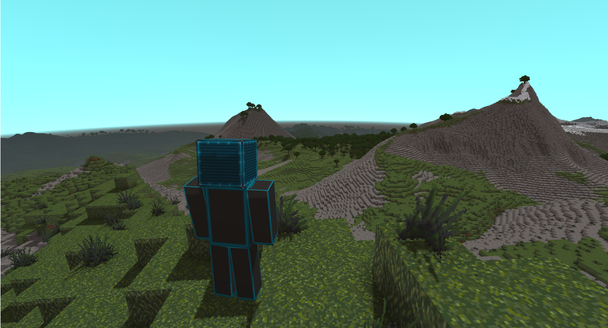

# AC Worldgen
This is a repository for a worldgen system for AnotherCraft. The system is completely standalone and can be used for world generation in any voxel-based game. This is not a hard coded one-trick pony earth-like gen, this is a framework that allows you to easily generate and weak any voxel terrain you desire!



## System premise & features
* **Standalone application**, easy to integrate with your project, communicates with the client via the `stdin` and `stdout` pipes (see [the interface documentation](docs/app_interface.md)).
* **Fully customizable generation** using the WOGLAC programming language.
* Decently fast, written in C++. Parallel procgen implemented.
* On demand generation of any part of the world (4-byte integer for X, Y and Z coordinates). 
* **Open source**.

### Procgen features
* 2D & 3D Perlin noise, voronoi-based generation.
* Domain warping (using the `sampleOffset` function with variable offset parameters).
* Grammar-based structure generation.
* Can import voxel prefabs in the ˙.vox˙ format.

### System structure
* WorldGenAPI, which is a parallel-enabled worldgen system backend (can also be used standalone, the generation pipeline can be constructed using API calls)
* The WOGLAC (WOrldGen Language for AnotherCraft) programming language compiler that compiles the WOGLAC code into WorldGenAPI calls.
  * Language documentation can be found in the [ac-docs repository](https://github.com/AnotherCraft/ac-docs/tree/master/woglac).
  * Files in `woglac/parser` are autogenerated by Antlr4 from grammar `grammar/Woglac.g4` (you can use the `grammar/gen_parser.sh` script).
  
## Documentation & resources
* **[Application usage](docs/app_interface.md)**
* **[WOGLAC tutorial](docs/woglac_tutorial.md)**
* **[WOGLAC language reference](docs/woglac_reference.md)**
* **[Function list](docs/function_list.md)**
* **[VS Code extension for WOGLAC](https://github.com/AnotherCraft/ac-woglac-vscode)**


* [Full ANTLR grammar](grammar/Woglac.g4)
* [Worldgen basics (youtube video)](https://www.youtube.com/watch?v=yqHEID7LIU4)

### WOGLAC example code
See the [examples](examples) folder.
```WOGLAC
Float z = worldPos()::z();
Float terrainZ = 195;

// That #342 is a function-local seed.
// The seeds are entered manually like this so that even when moving the function around, it still produces the same results. 
export Block resultBlock = z < terrainZ ? (rand2D(#342) < 0.5 ? block.core.dirt : block.core.grass) : block.air;
```

## Third-party resources
* Antlr4
* Tracy (for debugging purposes)