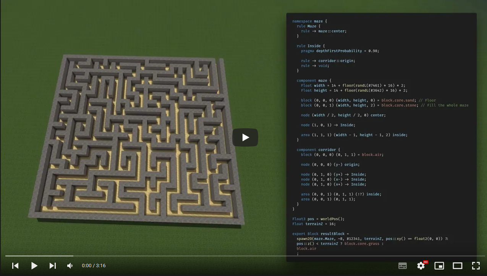

# AC Worldgen
AnotherCraft project procedural voxel world generation system. The system is completely standalone and can be used for world generation in any voxel-based game. This is not a hard coded one-trick pony earth-like gen, this is a framework that allows you to easily generate and tweak any voxel terrain you desire!

> **!! This repository is only for the worldgen system itself. World rendering/visualisation is up to you to implement.**

[](https://www.youtube.com/watch?v=2J9Yz_xckP0&list=PL1ORR7k1MR2G_tjmxt4GLn3EXZbd9JuSn&index=1)

## System premise & features
* **Standalone application**, easy to integrate with your project, communicates with the client via the `stdin` and `stdout` pipes (see [the interface documentation](docs/app_interface.md)).
* **Fully customizable generation** using the WOGLAC programming language.
* Decently fast, written in C++. Parallel generation. You can expect around 2 ms per one 16×16×16 chunk generated per thread with decently complicated worldgen. Some operations are slower than other ofc.
* On demand generation of any part of the world at any time (4-byte integer for X, Y and Z coordinates).
* Fully deterministic, always provides the same results, no matter the order of generation.
* **Open source**.

### Procgen features
* 2D & 3D Perlin, OpenSimplex (using FastNoise2), Voronoi/Worley-based noise functions.
* Domain warping.
* Biomes.
* Grammar-based structure generation that allows generating anything from trees to cities.
* Can import voxel prefabs in the ˙.vox˙ format ([MagicaVoxel editor](https://ephtracy.github.io/) or [Goxel editor](https://goxel.xyz/)).

### System structure
* WorldGenAPI, which is a parallel-enabled worldgen system backend (can also be used standalone, the generation pipeline can be constructed using API calls)
* The WOGLAC (WOrldGen Language for AnotherCraft) programming language compiler that compiles the WOGLAC code into WorldGenAPI calls.
  * Language documentation can be found in the [ac-docs repository](https://github.com/AnotherCraft/ac-docs/tree/master/woglac).
  * Files in `woglac/parser` are autogenerated by Antlr4 from grammar `grammar/Woglac.g4` (you can use the `grammar/gen_parser.sh` script).
  

## Documentation & resources
* **[Application usage](docs/app_interface.md)**
* **[WOGLAC tutorial](docs/tutorial/README.md)**
* **[WOGLAC language reference](docs/woglac_reference.md)**
* **[Function list](docs/function_list.md)**
* **[VS Code extension for WOGLAC](https://github.com/AnotherCraft/ac-woglac-vscode)**


* [Full ANTLR grammar](grammar/Woglac.g4)
* [AC Worldgen videos/tutorials playlist](https://youtube.com/playlist?list=PL1ORR7k1MR2G_tjmxt4GLn3EXZbd9JuSn)

### Contact/social
* [AC Worldgen dedicated **subreddit**](https://www.reddit.com/r/acworldgen/)
* [AnotherCraft **discord** server](https://discord.gg/anothercraft)

### WOGLAC example code
See the [examples](examples) folder.
```WOGLAC
Float z = worldPos()::z();
Float terrainZ = 195;

// That #342 is a function-local seed.
// The seeds are entered manually like this so that even when moving the function around, it still produces the same results. 
export Block resultBlock = z < terrainZ ? (rand2D(#342) < 0.5 ? block.core.dirt : block.core.grass) : block.air;
```

## Third-party resources
* Antlr4
* Tracy
* FastNoise2

## License
AC Worldgen is licensed under LGPL, which means you can incorporate it even into your commercial voxel projects free-of-charge. The system runs as a standalone application, so your code can stay closed source. You however have to make available any changes you've done to the AC Worldgen system itself. It would also be very nice of you to mention us in your credits.