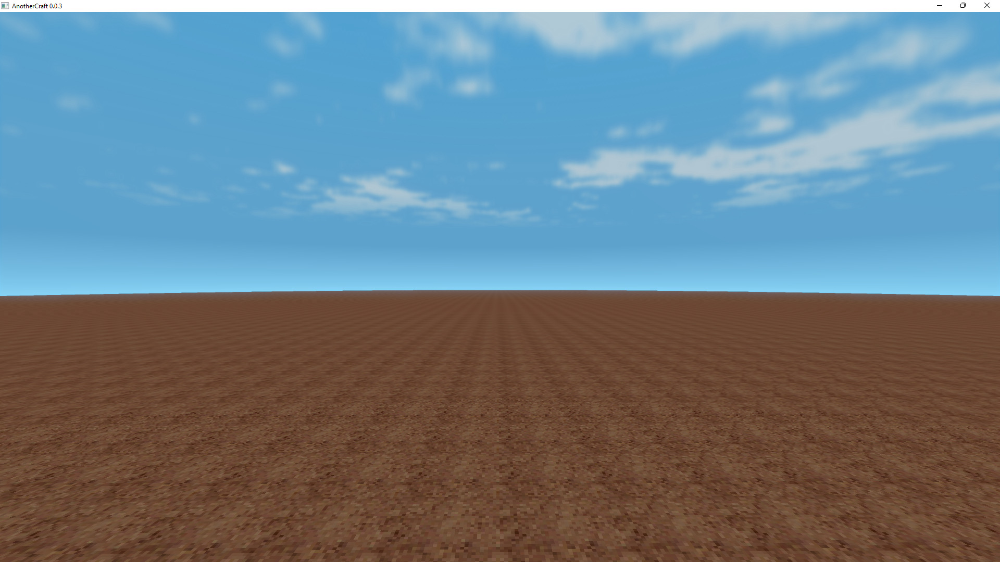
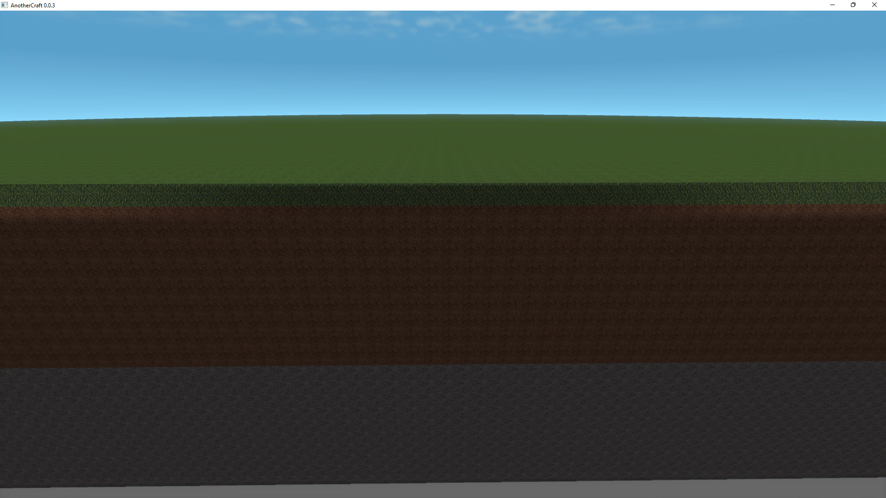

# Flatlands
Let's start with generating flatlands. We'll use the `Float3 worldPos()` function that returns the position of the block we're currently generating and the `Float z(Float3 vec)` that returns the `z` component of a vector.

```WOGLAC
export Block resultBlock = worldPos()::z() < 20 ? block.core.dirt : block.air;
```


We define an `export` variable `resultBlock` (that we'll be querying from the client application - see [Application interface](app_interface.md)) and set it to `block.core.dirt` for blocks that are below `z` `20` or to air for the blocks above. Simple.

The only weird thing is the `worldPos()::z()` syntax. In WOGLAC, `a::func(b, c)` is equivalent to `func(a, b, c)`, so we might as well have written `z(worldPos())`, but in this case, using the `::` makes the code more readable. This is similar to the [Uniform function call syntax](https://en.wikipedia.org/wiki/Uniform_Function_Call_Syntax).

## Layered flatlands
What if we want to have multiple layers? Simply use a ternary operator!

```WOGLAC
Float z = worldPos()::z();

export Block resultBlock = worldPos()::x() < 0 ? block.air : z < 10 ? block.core.stone : z < 19 ? block.core.dirt : z < 20 ? block.core.grass : block.air;
```

