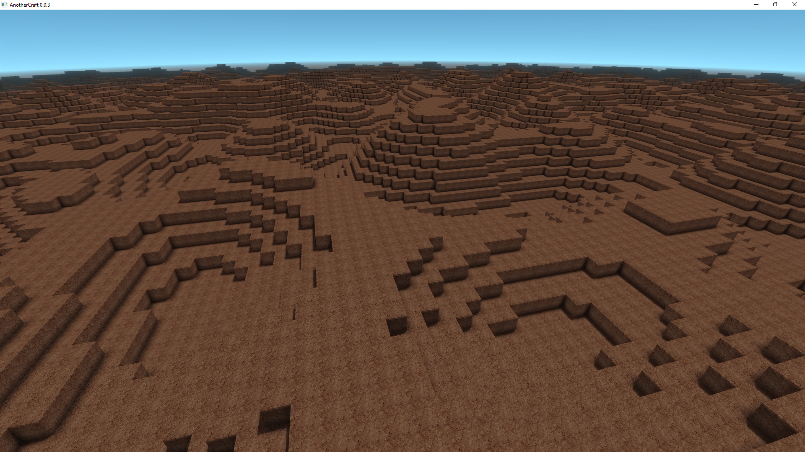
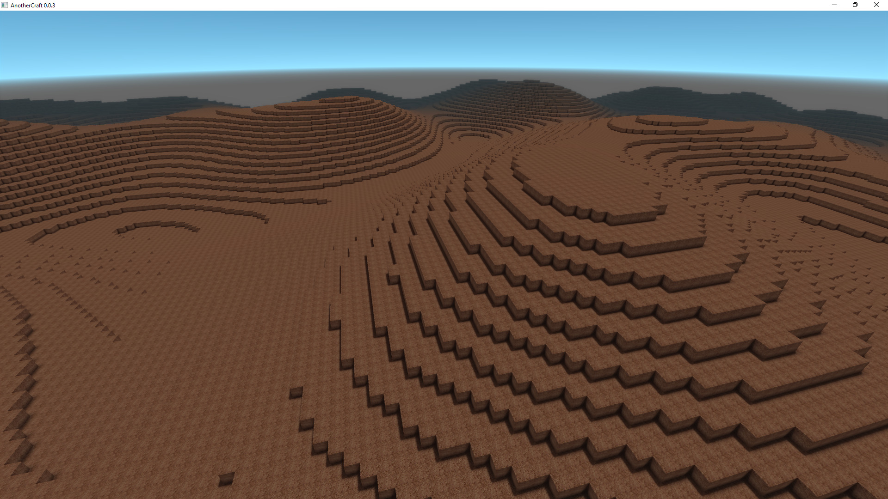
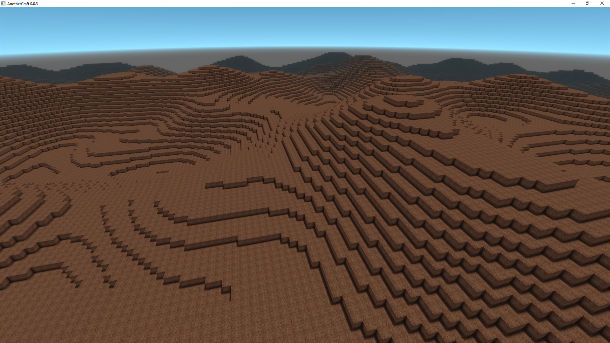
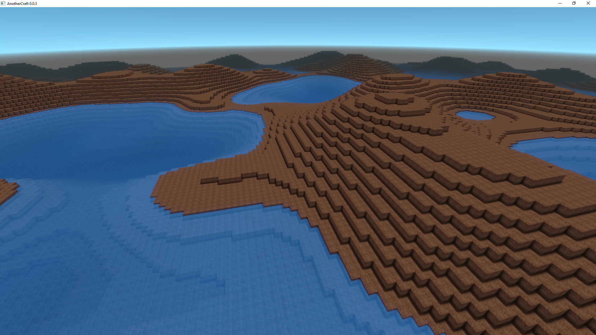
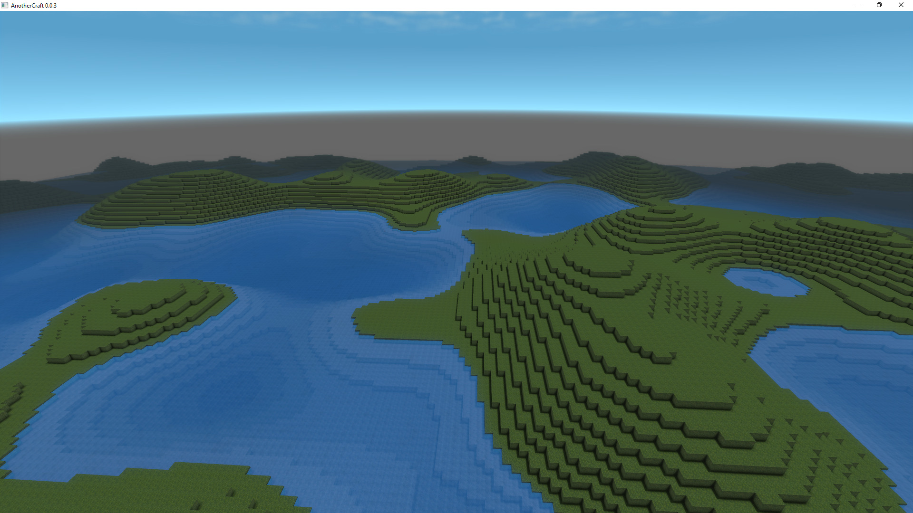
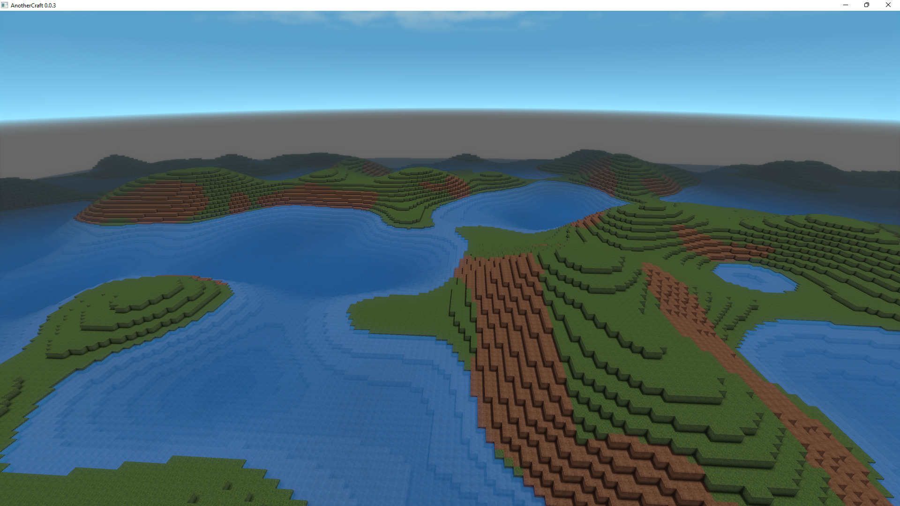

# Hills
For generating hills, we can start off with basic 2D [Perlin noise](https://en.wikipedia.org/wiki/Perlin_noise). For that, woglac offers the function `Float perlin2D(Float scale, Float seed)` that returns `-1` to `1` for each `x, y` position. `scale` denotes the scale of the noise in chunks (16 blocks). For `seed` we just bash the keyboard for some random number to make the noise unique – calling the function with the same seed always produces the same results. To make the code more readable, the `scale` paremeters are prefixed with `~` and `seed` parameters are prefixed with `#`.

```WOGLAC
Float z = worldPos()::z();

Float noiseHeight = 10;
Float terrainZ = 20 + perlin2D(~1, #6648) * noiseHeight;
export Block resultBlock = z < terrainZ ? block.core.dirt : block.air;
```


Okay, now let's make the hills bigger by increasing the `scale` and higher by increasing `noiseHeight`:
```WOGLAC
Float z = worldPos()::z();

Float noiseHeight = 20;
Float terrainZ = 10 + perlin2D(~4, #6648) * noiseHeight;
export Block resultBlock = z < terrainZ ? block.core.dirt : block.air;
```


## Multiple noise octaves
Now these look too uniform. We can add more variation by adding a second, smaller Perlin noise:
```WOGLAC
Float z = worldPos()::z();

Float noiseHeight = 20;
Float terrainZ = 10 + perlin2D(~4, #6648) * noiseHeight + perlin2D(~2, #6648) * noiseHeight * 0.5;
export Block resultBlock = z < terrainZ ? block.core.dirt : block.air;
```


## Water
Now we can also add water:
```WOGLAC
Float z = worldPos()::z();

Float noiseHeight = 20;
Float waterZ = 10;
Float terrainZ = 10 + perlin2D(~4, #6648) * noiseHeight + perlin2D(~2, #6648) * noiseHeight * 0.5;
export Block resultBlock = z < terrainZ ? block.core.dirt : z < waterZ ? block.core.water : block.air;
```


## Grass
Now let's add grass. Let's say we will add grass only on the top, when we're not under water and when the hill is not too steep.

Let's start without the steepness limitation. We'll define helper variables `terrainBlock` to store what block should be used as a terrain block and `terrainTopBlock` representing what block should be used on the top of the terrain on the given position. We also do a bit of rounding to make sure things fit nicely on the voxel grid.
```WOGLAC
export Float chunkZOffset = 0;

Float z = worldPos()::z();

Float noiseHeight = 20;
Float waterZ = 10;
Float terrainZ = round(10 + perlin2D(~4, #6648) * noiseHeight + perlin2D(~2, #6648) * noiseHeight * 0.5);

Block terrainTopBlock = 
	z < waterZ ? block.core.dirt :
	block.core.grass
	;

Block terrainBlock =
	z <= terrainZ - 1 ? block.core.dirt :
	terrainTopBlock
	;

export Block resultBlock =
	z <= terrainZ ? terrainBlock :
	z <= waterZ ? block.core.water :
	block.air
	;
```


## Grass gradient
Now let's limit grass only on areas that are not steep. To do that, we need to calculate the terrain steepness - its gradient. We can achieve that using the `Float sampleOffset(Float variable, Float3 offset)` function - we sample the terrain height at `x+1` and `x-1` and calculate the difference, then we do the same on `y+1` and `y-1` and we combine the results:
```WOGLAC
export Float chunkZOffset = 0;

Float z = worldPos()::z();

Float noiseHeight = 20;
Float waterZ = 10;

Float terrainZDecimal = 10 + (perlin2D(~4, #6648) + perlin2D(~2, #6648) * 0.5) * noiseHeight;
Float terrainZ = round(terrainZDecimal);

Float terrainZGradient = max(
		abs(sampleOffset(terrainZDecimal, float3(1, 0, 0)) - sampleOffset(terrainZDecimal, float3(-1, 0, 0))),
		abs(sampleOffset(terrainZDecimal, float3(0, 1, 0)) - sampleOffset(terrainZDecimal, float3(0, -1, 0)))
	);

Block terrainTopBlock = 
	z < waterZ ? block.core.dirt :
	terrainZGradient > 0.9 ? block.core.dirt :
	block.core.grass
	;

Block terrainBlock =
	z <= terrainZ - 1 ? block.core.dirt :
	terrainTopBlock
	;

export Block resultBlock =
	z <= terrainZ ? terrainBlock :
	z <= waterZ ? block.core.water :
	block.air
	;
```
