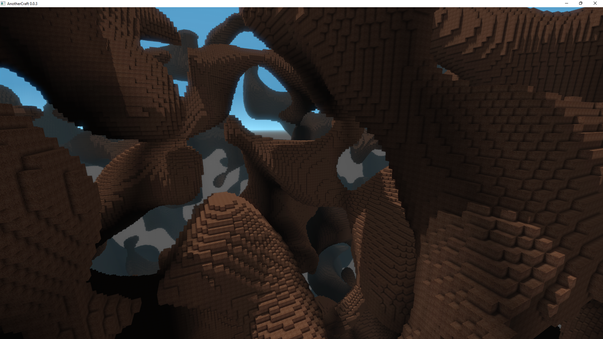
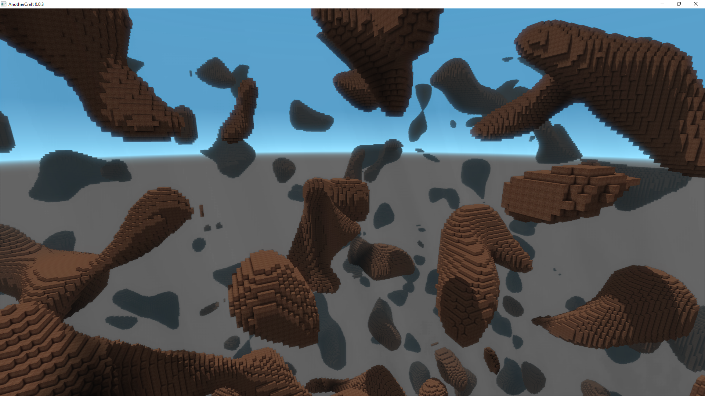
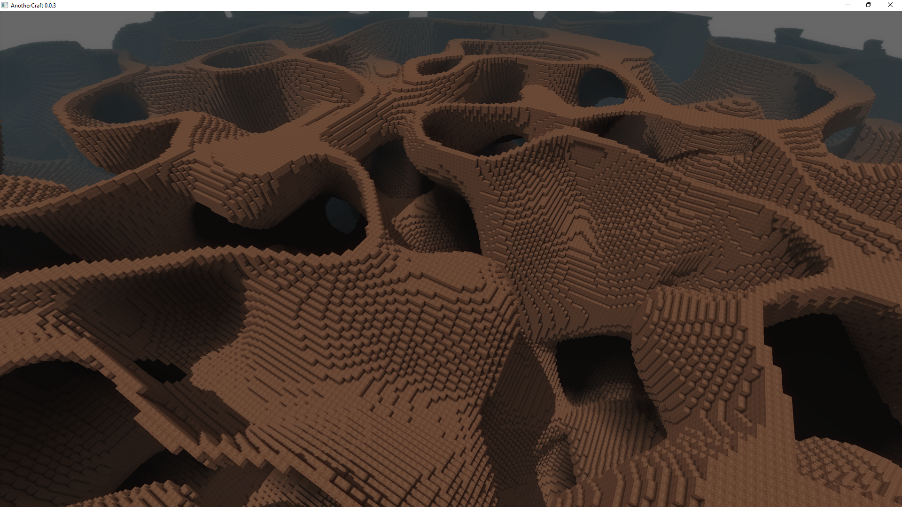
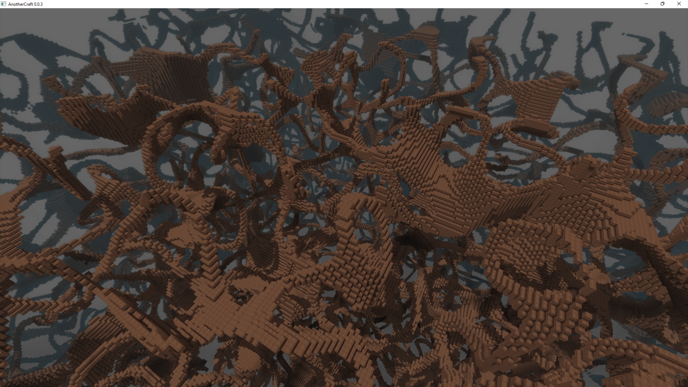
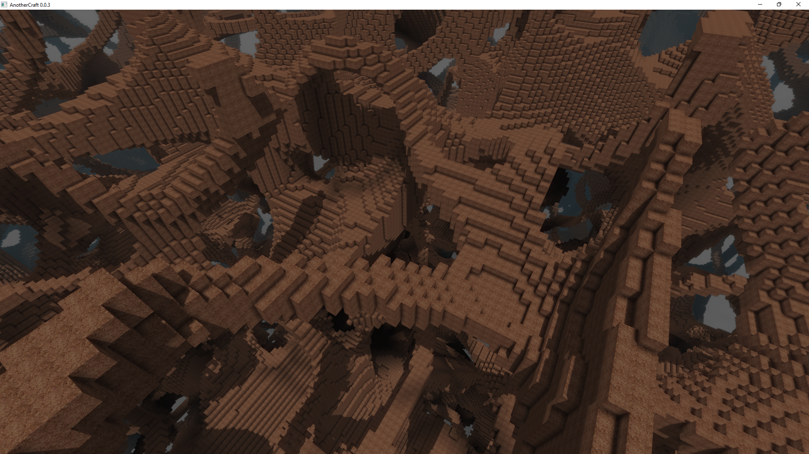
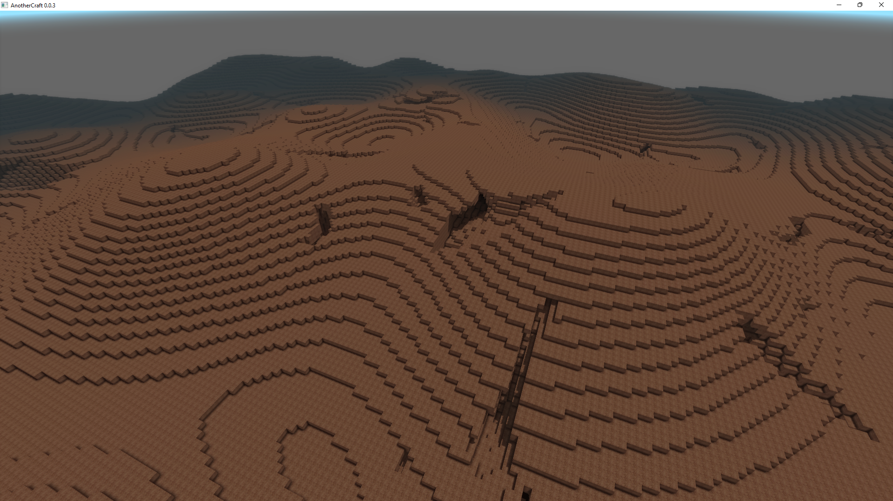
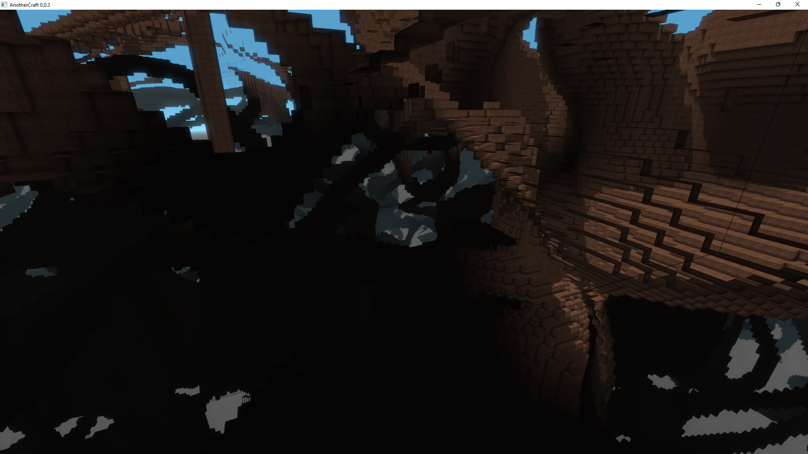

# Caves
So far we've only worked with heightmap-based terrain generation, which was mostly 2D. Now let's enrich our worldgen with fully 3D elements - caves. We'll be using [3D Perlin Noise](https://en.wikipedia.org/wiki/Perlin_noise) for that. In WOGLAC, we have function `Float perlin3D(Float octaveSize, Float seed)`, which works basically the same as the `perlin2D` function, except the generated noise is 3-dimensional.

Let's see how the noise looks like. The noise returns values from `-1` to `1`, so let's set pick a threshold and see what it does:
```WOGLAC
export Block resultBlock = perlin3D(~2, #352) < -0.3 ? block.core.dirt : block.air;
```


This could theoretically be used for the caves as-is, but there's a problem with controlling the cave size. When we lower the threshold, the noise splits into disconnected blobs:
```WOGLAC
export Block resultBlock = perlin3D(~2, #352) < -0.5 ? block.core.dirt : block.air;
```


## Isosurfaces
Let's explore the 3D Perlin noise further. The noise is of such nature that its value goes through zero quite often. When we select areas of the noise that are close to zero, we get what's called an *isosurface* (surface where the underlying Perlin noise field has the same value).
```WOGLAC
export Block resultBlock = abs(perlin3D(~2, #352)) < 0.05 ? block.core.dirt : block.air;
```


While this looks interesting, it's not really suitable for caves generation. But what if we intersect two different isosurfaces?
```WOGLAC
Bool isoSurface1 = abs(perlin3D(~2, #352)) < 0.05;
Bool isoSurface2 = abs(perlin3D(~2, #1324)) < 0.05;
export Block resultBlock = (isoSurface1 && isoSurface2) ? block.core.dirt : block.air;
```


This formula has quite nice features for cave generation. It generates a dense network of interconnected tunnels. We can also mix in a more standard 3D perlin noise to add some larger rooms here and there:
```WOGLAC
Float isoSurface1 = 1 - abs(perlin3D(~2, #352));
Float isoSurface2 = 1 - abs(perlin3D(~2, #1324));
Float caves = max(0, (perlin3D(~4, #4342) - 0.3) * 1.5);

export Block resultBlock = (isoSurface1 * isoSurface2 + caves > 0.9) ? block.core.dirt : block.air;
```


## Combining with terrain
Now let's see how we can combine our caves code with the terrain code from previous tutorials. We'll use a simple single-noise 2D Perlin height map. For terrain, we define variable `terrainBlock` that says where the terrain should be and what block to use for the terrain. If we're above terrain, the variable will have value `block.undefined`. We use `block.undefined` instead of `block.air`, because `block.undefined` can is implicitly cast to `false` in the ternary operator. We do the same for the caves - variable `cavesBlock`, set to `block.air` where we want to have the caves and to `block.undefined` where we want to keep the terrain. Then, we just combine variables using the ternary operator `if ? then : else`, or in this case the ternary coalescing operator `a ?: b`, which is equivalent to `a ? a : b`:

```WOGLAC
Float isoSurface1 = 1 - abs(perlin3D(~2, #352));
Float isoSurface2 = 1 - abs(perlin3D(~2, #1324));
Float caves = max(0, (perlin3D(~4, #4342) - 0.3) * 1.5);

Block cavesBlock = (isoSurface1 * isoSurface2 + caves > 0.9) ? block.air : block.undefined;


Float z = worldPos()::z();
Float noiseHeight = 20;
Float terrainZ = 128 + perlin2D(~4, #6648) * noiseHeight;
Block terrainBlock = z < terrainZ ? block.core.dirt : block.undefined;

export Block resultBlock = cavesBlock ?: terrainBlock ?: block.air;
```



There should also be some tweaking done regarding cave entrances etc, but I'll leave that to you, this tutorial is to rather show the basic principles.