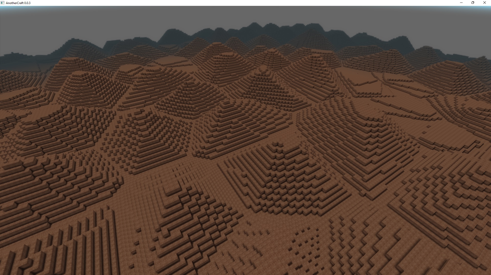
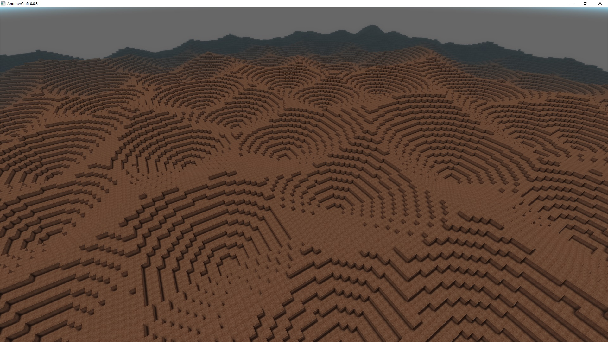
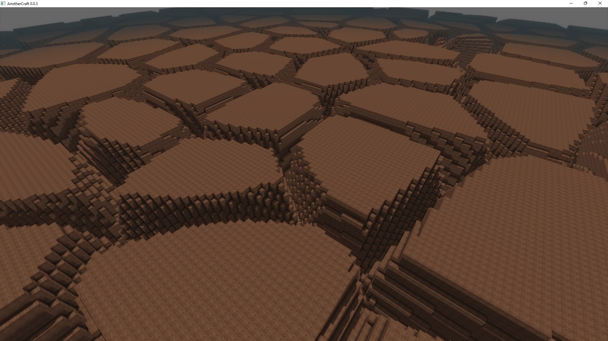
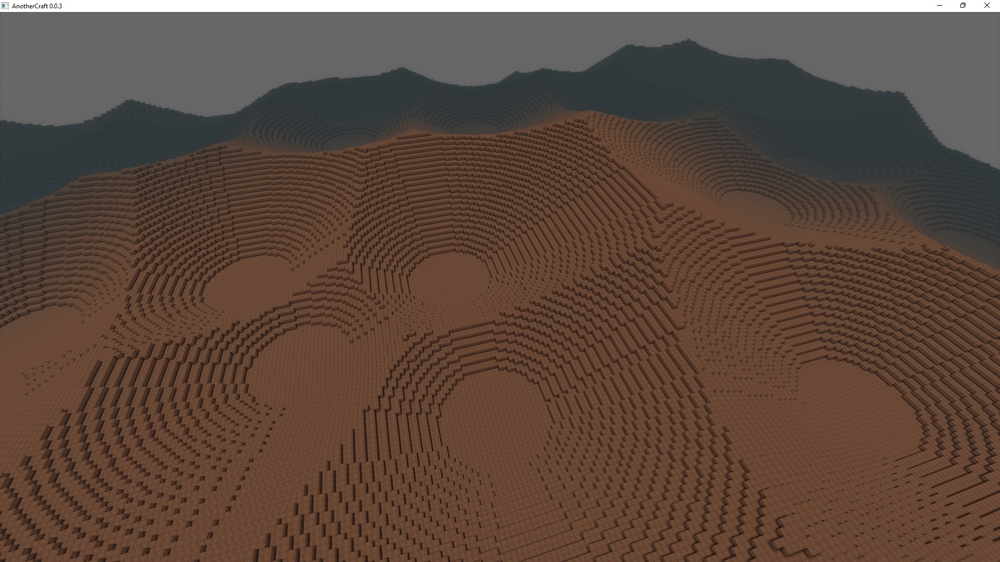
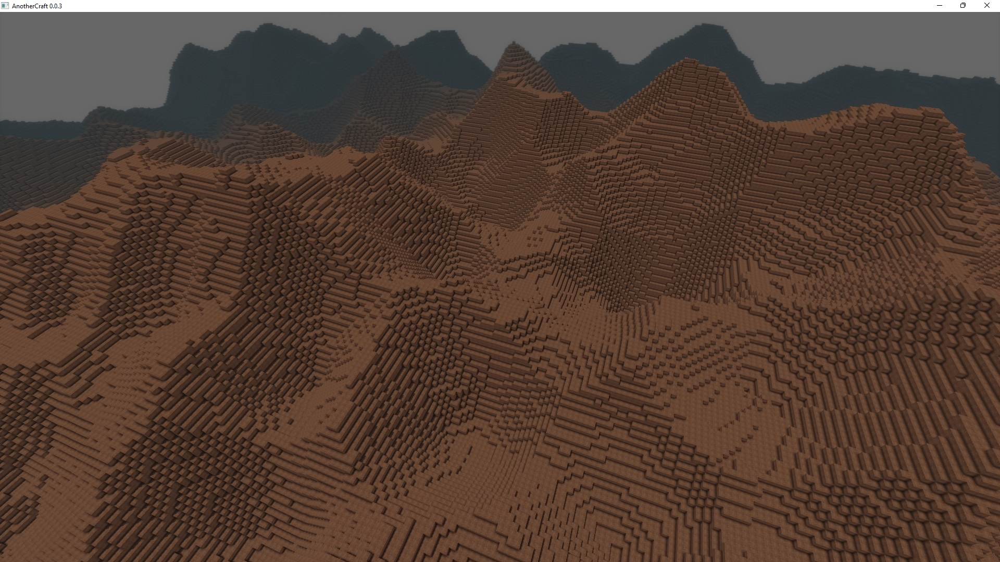
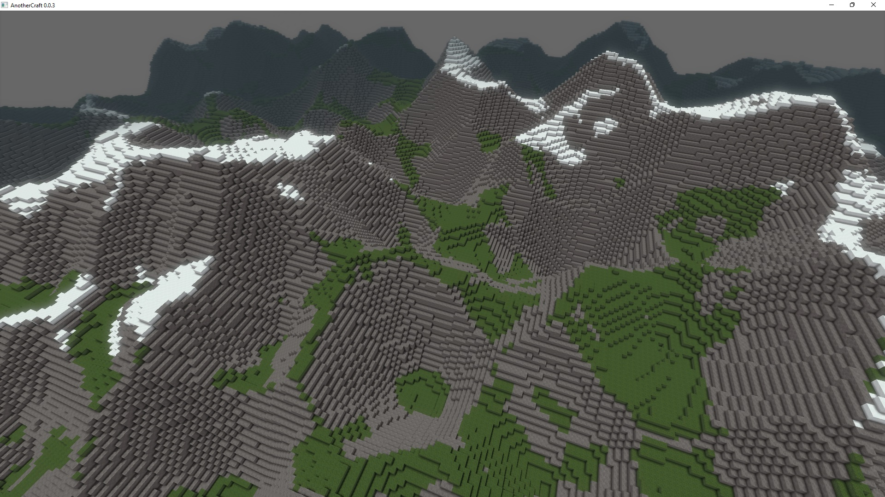

# Voronoi/Worley noise
[Worley noise](https://en.wikipedia.org/wiki/Worley_noise) is a noise working on the principles of [Voronoi diagrams](https://en.wikipedia.org/wiki/Voronoi_diagram): you start with points randomly spread across the space, the noise value is then based on the distance from the nearest points. WOGLAC provides the `voronoi2D` function to play around with the Voronoi noise [[function documentation]](../function_list.md#voronoi2d).

The noise looks like this:
```WOGLAC
Float resultType = 0; // also we test 1
export Block resultBlock = worldPos()::z() < 20 + voronoi2D(~2, #51321, resultType, 2) * 15 ? block.core.dirt : block.air;
```

`resultType = 0`


`resultType = 1`

 
The result types look quite smiliar when one of them is inverted, the main difference is that with `resultType = 0` (distance to the edge), the edges always start on the same level and the tip heights can differ, and with `resultType = 1` (distance to the point), the tips alwas start on the same level and the edges height can differ.

This type of noise can for example be used for cracked ground:
```WOGLAC
export Block resultBlock = worldPos()::z() < 64 + min(voronoi2D(~2, #51321, 0, 2) * 5, 1) * 15 ? block.core.dirt : block.air;
```


## Mountains
And it can also be used to generate some nice mountain peaks:
```WOGLAC
export Block resultBlock = worldPos()::z() < 16 + max(voronoi2D(~4, #51321, 1, 2) - 0.2, 0) * 32 ? block.core.dirt : block.air;
```


We can get quite a nice looking moutainous terrain by combining multiple Perlin a Voronoi noises:
```WOGLAC
Float terrainZ =
	16
	+ voronoi2D(~4, #51321, 1, 2) * 32
	+ voronoi2D(~2, #551, 1, 2) * 24
	+ voronoi2D(~1, #1237, 1, 2) * 4
	+ perlin2D(~4, #25321) * 32
	+ perlin2D(~2, #4513) * 16
	;

export Block resultBlock = worldPos()::z() < terrainZ ? block.core.dirt : block.air;
```


We can also add some gradient-based block selection:
```WOGLAC
Float terrainZ =
	16
	+ voronoi2D(~4, #51321, 1, 2) * 32
	+ voronoi2D(~2, #551, 1, 2) * 24
	+ voronoi2D(~1, #1237, 1, 2) * 4
	+ perlin2D(~4, #25321) * 32
	+ perlin2D(~2, #4513) * 16
	;

Float terrainGradient = max(
		abs(sampleOffset(terrainZ, float3(-2, 0, 0)) - sampleOffset(terrainZ, float3(2, 0, 0))),
		abs(sampleOffset(terrainZ, float3(0, -2, 0)) - sampleOffset(terrainZ, float3(0, 2, 0)))
	);

Float snowZ = 50 + perlin2D(~4, #35253) * 32;

Block terrainBlock =
	terrainGradient < 2.5 ? (terrainZ > snowZ ? block.core.snow : block.core.grass) :
	block.core.stone
	;

export Block resultBlock = worldPos()::z() < terrainZ ? terrainBlock : block.air;
```
