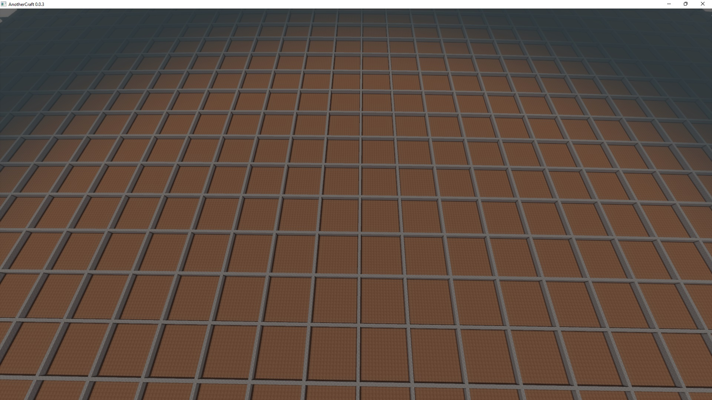
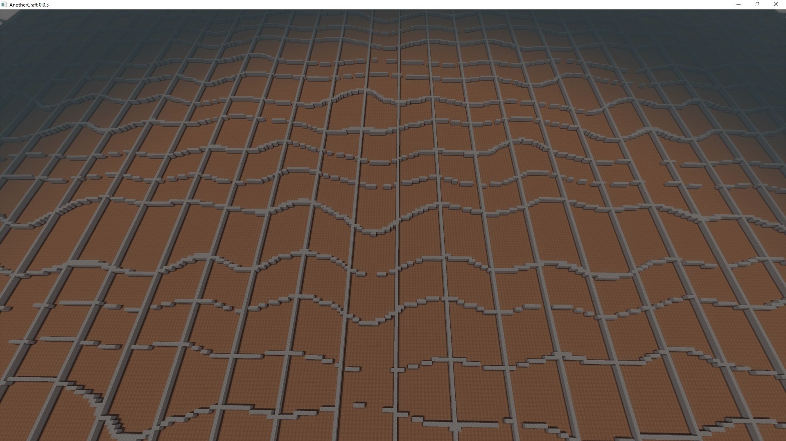
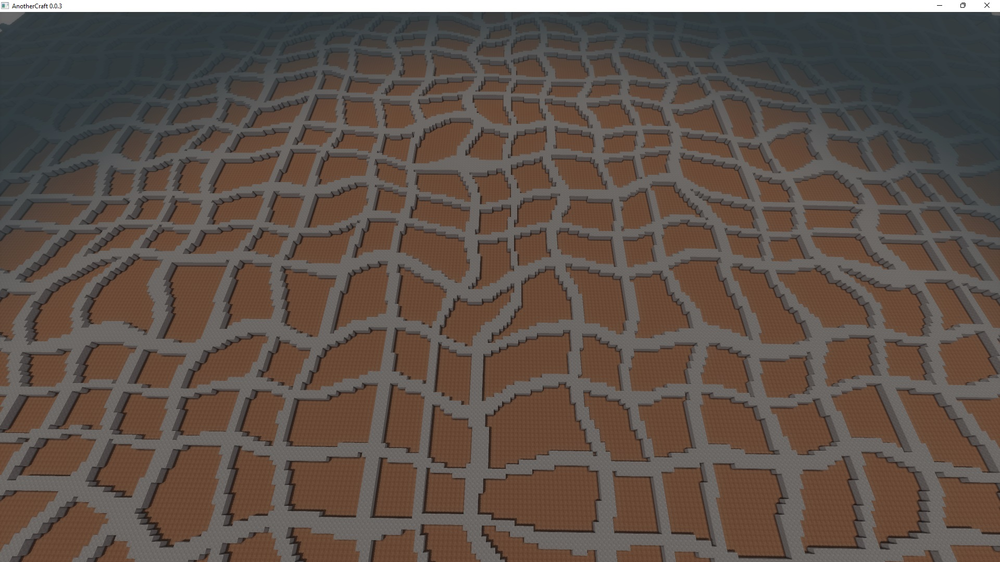
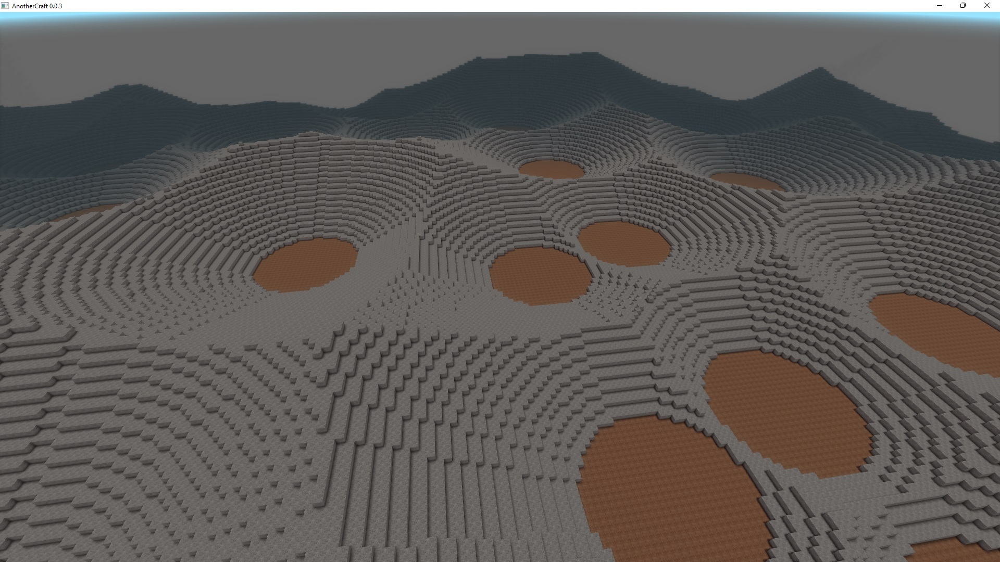
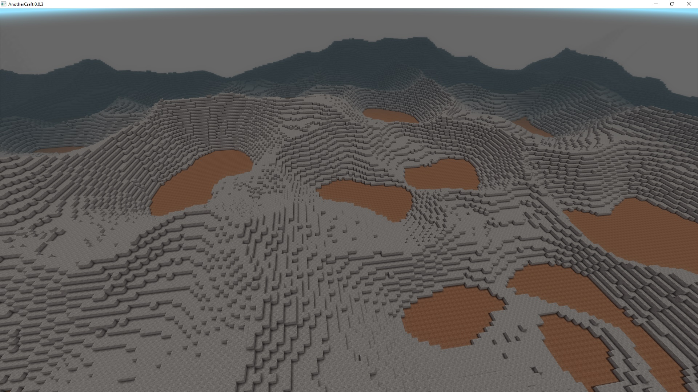
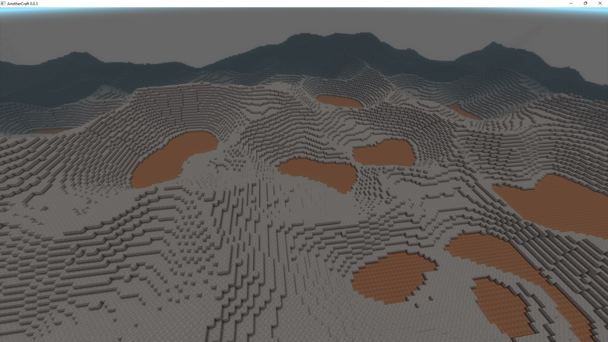

# Domain warping
Domain warping is a technique that allows us to warp a field variable, which can make the environment look more rich and break uniformity.

Let's start with generating a regular grid:
```WOGLAC
Float3 pos = worldPos();
Float z = pos::z();

Float2 gridCoef = abs(ffract(pos::xy() / 16) - 0.5);
Bool isGrid = gridCoef::x() < 0.05 || gridCoef::y() < 0.05;

export Block resultBlock =
	z < 10 ? block.core.dirt :
	z < 12 && isGrid ? block.core.stone :
	block.air
	;
```


We can now warp the `isGrid` field using the `Bool sampleOffset(Bool variable, Float3 offset)` function. The trick is that the `offset` can change for each position:
```WOGLAC
Float3 pos = worldPos();
Float z = pos::z();

Float2 gridCoef = abs(ffract(pos::xy() / 16) - 0.5);
Bool isGrid = gridCoef::x() < 0.05 || gridCoef::y() < 0.05;

Float3 warpVector = float3(perlin2D(~2, #52532) * 16, 0, 0);
Bool isGirdWarped = sampleOffset(isGrid, warpVector);

export Block resultBlock =
	z < 10 ? block.core.dirt :
	z < 12 && isGirdWarped ? block.core.stone :
	block.air
	;
```


And that's the idea of the arping - we've warped the `x` domain of the `isGrid` variable using Perlin 2D noise.

The warping is done at discrete steps aligned to the voxel grid, so there will be some rounding artifacts you should take into account. Let's solve that now by increasing the grid thickness. Also we'll add a separate warping for the `y` domain:
```WOGLAC
Float3 pos = worldPos();
Float z = pos::z();

Float2 gridCoef = abs(ffract(pos::xy() / 16) - 0.5);
Bool isGrid = gridCoef::x() < 0.1 || gridCoef::y() < 0.1;

Float3 warpVector = float3(perlin2D(~2, #52532) * 16, perlin2D(~2, #1231) * 16, 0);
Bool isGirdWarped = sampleOffset(isGrid, warpVector);

export Block resultBlock =
	z < 10 ? block.core.dirt :
	z < 12 && isGirdWarped ? block.core.stone :
	block.air
	;
```


## Using on mountains
What is this good for? Well, a very nice use case is generating mountains. Let's take the basic Voronoi mountains example from the previous tutorial:
```WOGLAC
Float3 pos = worldPos();
Float z = pos::z();

Float mountainsZ = max(voronoi2D(~4, #51321, 1, 2) - 0.2, 0) * 32;

export Block resultBlock =
	z < 16 ? block.core.dirt :
	z < 16 + mountainsZ ? block.core.stone :
	block.air
	;
```


And now let's warp it:
```WOGLAC
Float3 pos = worldPos();
Float z = pos::z();

Float mountainsZ = max(voronoi2D(~4, #51321, 1, 2) - 0.2, 0) * 32;

Float3 warpVector = float3(perlin2D(~2, #52532) * 32, perlin2D(~2, #1231) * 32, 0);
Float mountainsZWarped = sampleOffset(mountainsZ, warpVector);

export Block resultBlock =
	z < 16 ? block.core.dirt :
	z < 16 + mountainsZWarped ? block.core.stone :
	block.air
	;
```


As you can see, the warping immediately makes the mountains much nicer. Because the domain warping introduced some rounding artefacts, we can smoothen the terrain a bit:
```WOGLAC
Float3 pos = worldPos();
Float z = pos::z();

Float mountainsZ = max(voronoi2D(~4, #51321, 1, 2) - 0.2, 0) * 32;

Float3 warpVector = float3(perlin2D(~2, #52532) * 32, perlin2D(~2, #1231) * 32, 0);
Float mountainsZWarped = sampleOffset(mountainsZ, warpVector);

Float mountainsZWarpedSmoothed = (
	mountainsZWarped
	+ sampleOffset(mountainsZWarped, float3(1, 0, 0)) 
	+ sampleOffset(mountainsZWarped, float3(0, 1, 0))
	) / 3;

export Block resultBlock =
	z < 16 ? block.core.dirt :
	z < 16 + mountainsZWarpedSmoothed ? block.core.stone :
	block.air
	;
```
