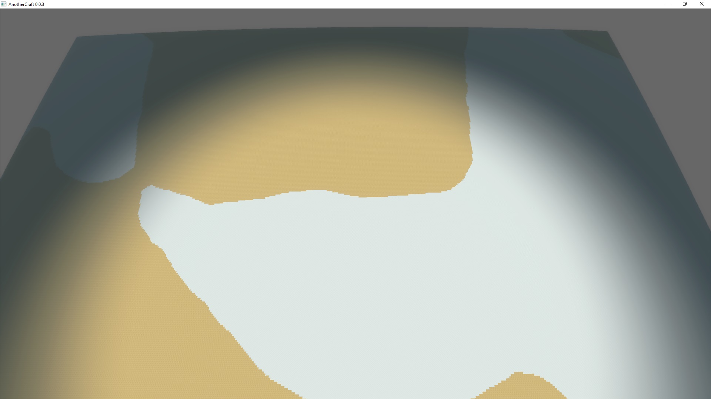
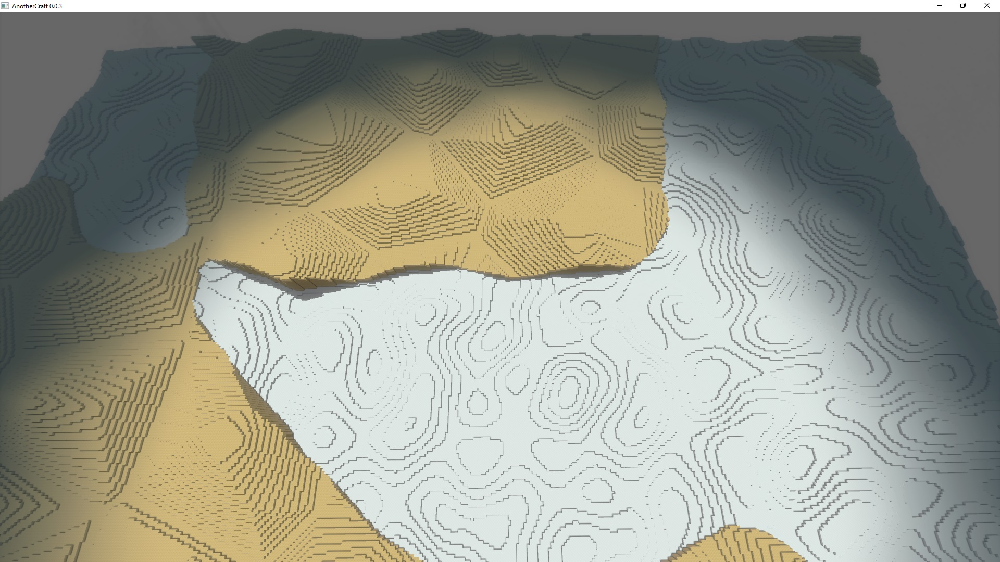
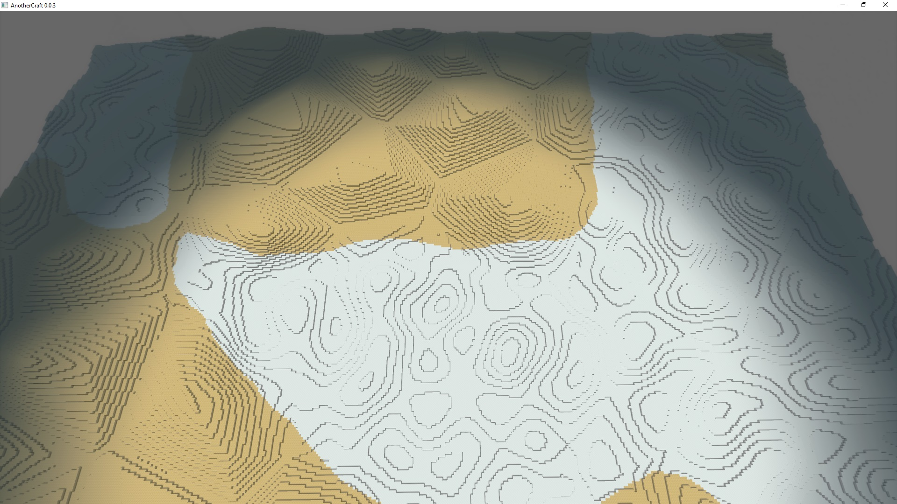
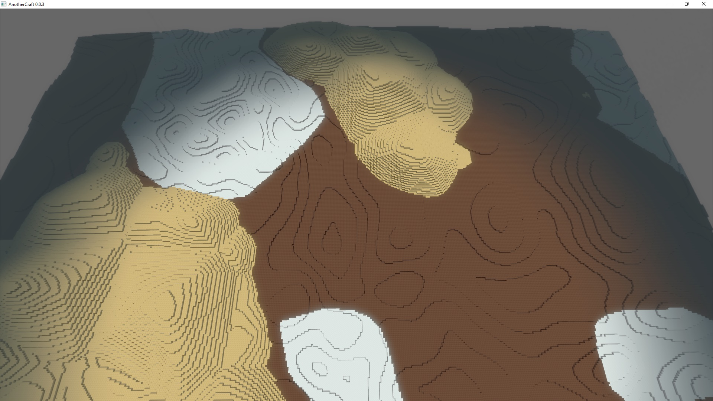

# Biomes
The AC Worldgen system has a built-in support for biomes. They work as folows:
* Biome variables are introduced. They work similar to standard variables, but each biome can override their value with its own implementation.
* Biomes can be defined using a special syntax. Each biome can override any biome variable and provide its own implementation.
* Biomes can have conditions assigned. Conditions specify in what situations a given biome should be selected.
* The world is split into a 2D grid (cell size can be defined using `pragma biomeGridSize`, default is 256). Each cell gets assigned a biome with the best fitting conditions.
* Biome variables then can be used for world generation.

Let's start small. We shall define two biomes, one called `tundra`, one called `desert`.
```WOGLAC
biome tundra {

}

biome desert {

}
```

Now, we say that we want tundra to be generated where temperature is low and desert where temperature is high. For that, we define a new variable `temperature` and use it as a condition for the biomes.

```WOGLAC
Float temperature = perlin2D(~8, #13215);

biome tundra {
	condition temperature = -1 +- 0.3;
}

biome desert {
	condition temperature = 1 +- 0.3;
}
```

Now, we say that we want snow in tundra and sand in the desert. For that, we define biome variable `biomeGroundBlock`. We set it to `block.core.dirt` by default unless a biome changes it to something else. Then we can use the `biome(param, nearest)` syntax to obtain `biomeGroundBlock` for the nearest biome:
```WOGLAC
pragma biomeGridSize = 64;

Float3 pos = worldPos();
Float z = pos::z();

Float temperature = perlin2D(~8, #13215);

biome param Block biomeGroundBlock ?= block.core.dirt;

biome tundra {
	condition temperature = -1 +- 0.3;
	param biomeGroundBlock = block.core.snow;
}

biome desert {
	condition temperature = 1 +- 0.3;
	param biomeGroundBlock = block.core.sand;
}

export Block resultBlock =
	z < 16 ? biome(biomeGroundBlock, nearest) : block.air
	;
```


Now, apart for defining ground block, we probably also want to have different terrain structure for the biomes. We can define a new biome variable `biomeTerrainZ` for that:
```WOGLAC
pragma biomeGridSize = 64;

Float3 pos = worldPos();
Float z = pos::z();

Float temperature = perlin2D(~8, #13215);

biome param Block biomeGroundBlock ?= block.core.dirt;
biome param Float biomeTerrainZ ?= 0;

biome tundra {
	condition temperature = -1 +- 0.3;
	param biomeGroundBlock = block.core.snow;
	param biomeTerrainZ = perlin2D(~2, #2542) * 8;
}

biome desert {
	condition temperature = 1 +- 0.3;
	param biomeGroundBlock = block.core.sand;
	param biomeTerrainZ = voronoi2D(~4, #325, 0, 2) * 16;
}

export Block resultBlock =
	z < 16 + biome(biomeTerrainZ, nearest) ? biome(biomeGroundBlock, nearest) : block.air
	;
```


Okay, so now we have different terrain shape for the biomes, but the transitions are sharp and ugly. We can solve that by interpolating the ˙biomeTerrainZ˙ using the `biome(param, weighted, exponent)` syntax:
```WOGLAC
export Block resultBlock =
	z < 16 + biome(biomeTerrainZ, weighted, 2) ? biome(biomeGroundBlock, nearest) : block.air
	;
```


That's the core idea behind biomes. We can use as many conditions and biome variables as we want to. Now of course transitioning between sand and snow in this way is a bit weird. In practice, we'll want have a separate variables for ground and sand, because these two should be mixed separately. Let's show a final example with three biomes, adding a `neutral` biome for transitioning:
```WOGLAC
pragma biomeGridSize = 64;

Float3 pos = worldPos();
Float z = pos::z();

Float temperature = perlin2D(~4, #13215) * 4;

biome param Block biomeGroundBlock ?= block.core.dirt;
biome param Float biomeGroundZ ?= 0;
biome param Float biomeSandZ ?= -16;

biome tundra {
	condition temperature = -1 +- 0.3;
	param biomeGroundBlock = block.core.snow;
	param biomeGroundZ = perlin2D(~2, #2542) * 8;
}

biome neutral {
	condition temperature = 0 +- 0.3;
	param biomeGroundZ = perlin2D(~4, #2542) * 8;
}

biome desert {
	condition temperature = 1 +- 0.3;
	param biomeSandZ = 8 + voronoi2D(~4, #325, 0, 2) * 16;
}

export Block resultBlock =
	z < 16 + biome(biomeSandZ, weighted, 2) ? block.core.sand :
	z < 16 + biome(biomeGroundZ, weighted, 2) ? biome(biomeGroundBlock, nearest) :
	block.air
	;
```
