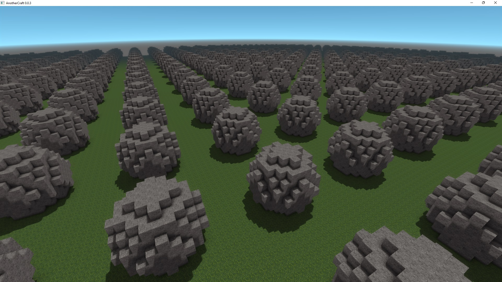

# Trees
Now let's have a look on how we can generate trees. This brings us to the structure generation system territory of AC Worldgen, which is another powerful system the worldgen offers. We have two new concepts: components and rules.

Components are building blocks of the structure generation – one component could for example correspond to one room in your generated house or dungeon. Components say what blocks should be placed and where. They can be defined parametrically from code or be imported from `.vox` files. A component can be spawned multiple times in the world, each has its own variables and local coordinate system.

Rules then decide which component will be selected for spawning.

## Generating cubes
Let's start with the simplest structure generation: we shall generate cubes:

```WOGLAC
component cube {
	node (0, 0, 0) origin;
	block (0, 0, 0) (4, 4, 4) = block.core.stone;
}

rule Cube {
	rule -> cube::origin;
}

Float3 pos = worldPos();
Float terrainZ = 16;

export Block resultBlock =
	spawn2D(Cube, ~1, #53214, terrainZ + 3, pos::xy()::mod(16) == float2(0)) ?:
	pos::z() < terrainZ ? block.core.grass :
	block.air
	;
```


Now of course the code deserves some explanation:
* We have defined a component `cube`, that shall place `block.core.stone` blocks in the area from `(0, 0, 0)` to `(4, 4, 4)` (inclusive, so the cube will have `5×5×5` blocks).
* We've also set up the `cube::origin` node so that rules know where to spawn the cubes from.
* We then created a very simple rule `Cube` that alwas spawns the `cube` component at `origin`.
* The spawning itself is then realized using the `Block spawn2D(Rule entryRule, Float maxRadius, Float seed, Float spawnZ, Bool spawnCondition)` function.
  * The function spawns the given `entryRule` on the `spawnZ` plane on all positions where `spawnCondition` is true.
  * We've set the condition to `pos::xy()::mod(16) == float2(0)`, which will be true for every 16th block in `x` and `y` axes.
  * The `maxRadius` defines the maximum size of the spawned structure (in chunks, horizontally). It tells the system how far it should look around a given block to see if there is a structure spawned that could influence the block.
  * The function returns a block defined by the structure generation for each position or `block.undefined` for positions where no structure is spawned.
  
Now, block areas don't have to be defined as mere constant blocks, they can be expressions! Let's make the code spawn spheres:
```WOGLAC
component sphere {
	Float radius = 5;

	node (0, 0, 0) origin;
	block (float3(-radius)) (float3(radius)) = origin::distanceTo() < radius - 0.5 ? block.core.stone : block.undefined;
}

rule Sphere {
	rule -> sphere::origin;
}

Float3 pos = worldPos();
Float terrainZ = 16;

export Block resultBlock =
	spawn2D(Sphere, ~1, #53214, terrainZ + 3, pos::xy()::mod(16) == float2(0)) ?:
	pos::z() < terrainZ ? block.core.grass :
	block.air
	;
```


## Moving to trees
Now let's take the previous example and try to make the cubes more tree-like:
```WOGLAC
component tree {
	Float radius = 3;
	Float height = 8;

	Float3 crownCenterPos = float3(0, 0, height);

	node (0, 0, 0) origin;
	node (crownCenterPos) crownCenter;

	block (crownCenterPos - radius) (crownCenterPos + radius) = crownCenter::distanceTo() < radius ? block.core.leaves.oak : block.undefined;
	block (0, 0, 0) (0, 0, height) = block.core.log.oak;
}

rule Tree {
	rule -> tree::origin;
}

Float3 pos = worldPos();
Float terrainZ = 16;

export Block resultBlock =
	spawn2D(Tree, ~1, #53214, terrainZ, pos::xy()::mod(16) == float2(0)) ?:
	pos::z() < terrainZ ? block.core.grass :
	block.air
	;
```


As you can see, we can define multiple block areas in one component, and they can even be overlapping - block area defined later overwrites the area defined before (in this case log overwrites leaves).

Great, now we can add a little more variation of the radius, height, and the tree positioning. Don't forget that variables inside components are also fields, so if we used say `rand3D` for determining tree height, we'd get a different value for each block of the tree itself, which would be a mess. Instead we use `randC` and provide it a unique seed based on the current component using the function `localSeed`.

We also get rid of the regular grid for spawning and use the `Bool poissonDisc2DBool(Float seed, Float radius)`, which distributes the spawn points irregularly. We can even vary the distribution density by making the `radius` parameter non-cosntant.

```WOGLAC
component tree {
	Float radius = 2 + randC(localSeed()) * 3;
	Float height = radius * 2;

	Float3 crownCenterPos = float3(0, 0, height);

	node (0, 0, 0) origin;
	node (crownCenterPos) crownCenter;

	block (crownCenterPos - radius) (crownCenterPos + radius) = crownCenter::distanceTo() < radius ? block.core.leaves.oak : block.undefined;
	block (0, 0, 0) (0, 0, height) = block.core.log.oak;
}

rule Tree {
	rule -> tree::origin;
}

Float3 pos = worldPos();
Float terrainZ = 16;

export Block resultBlock =
	spawn2D(Tree, ~1, #53214, terrainZ, poissonDisc2DBool(#2532, 6 + perlin2D(~4, #2532) * 5)) ?:
	pos::z() < terrainZ ? block.core.grass :
	block.air
	;
```
