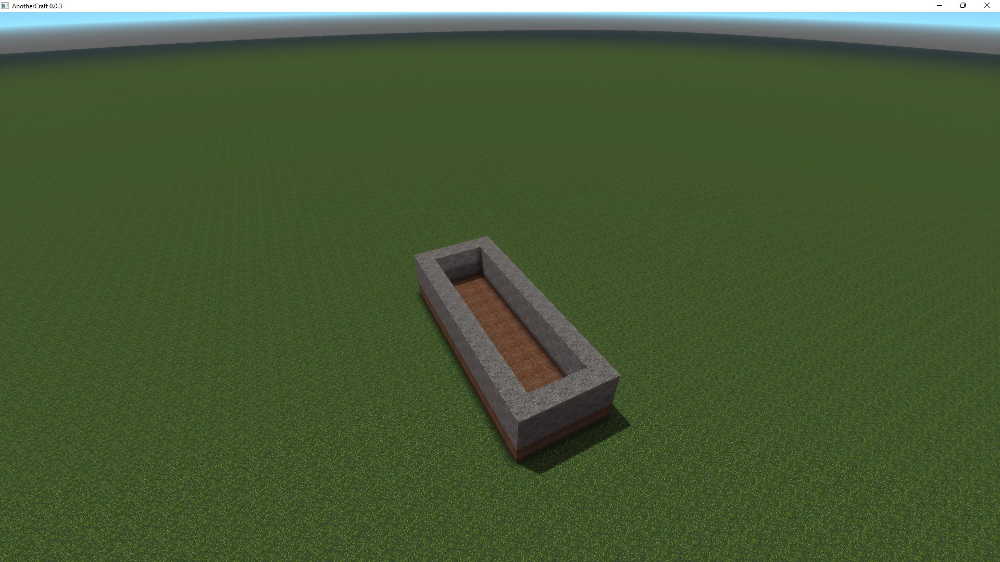
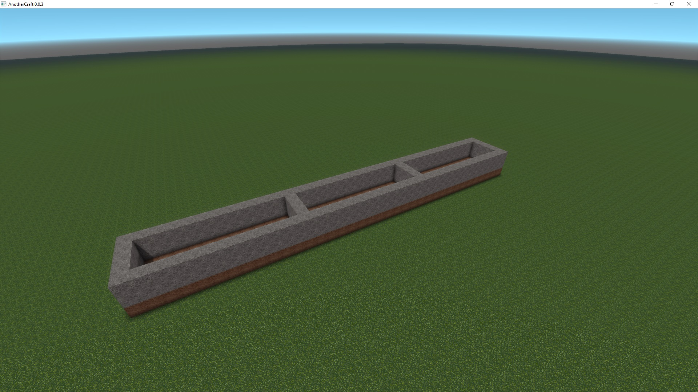
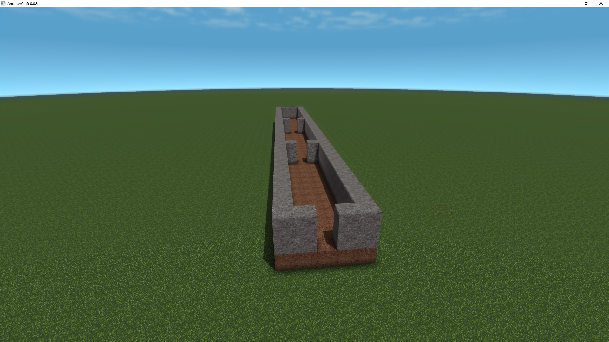
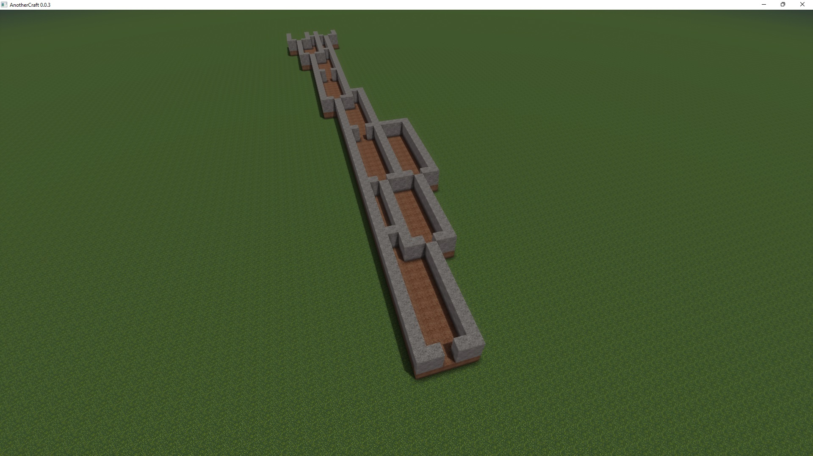
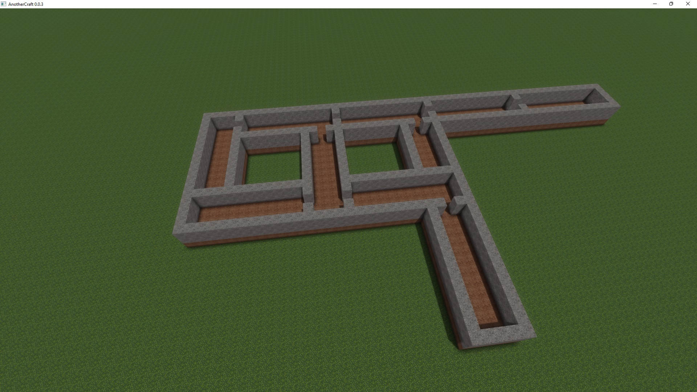
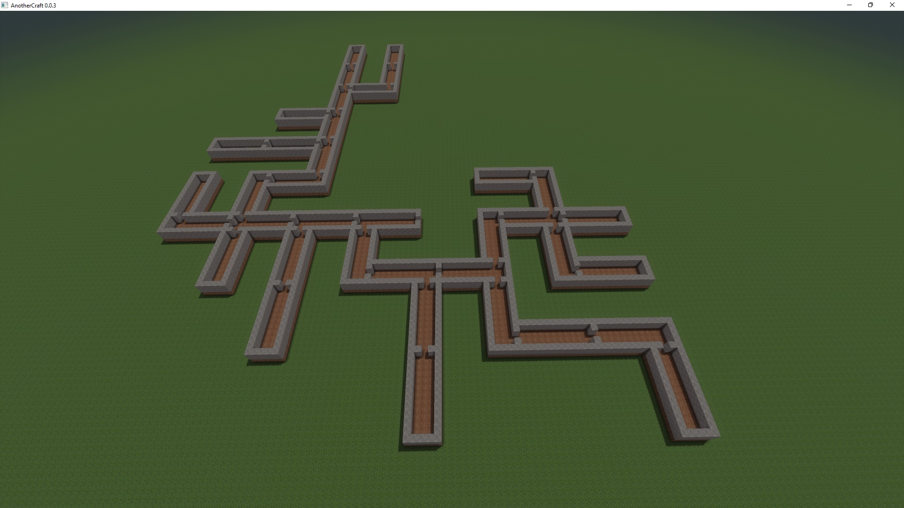
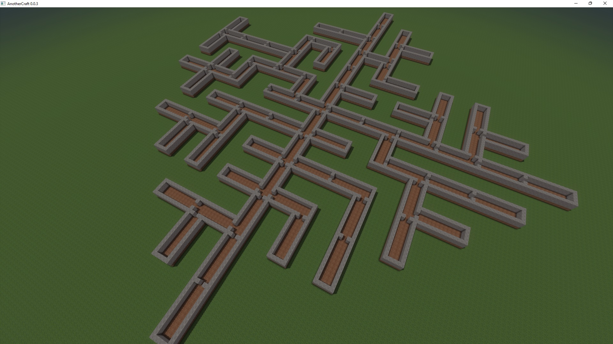
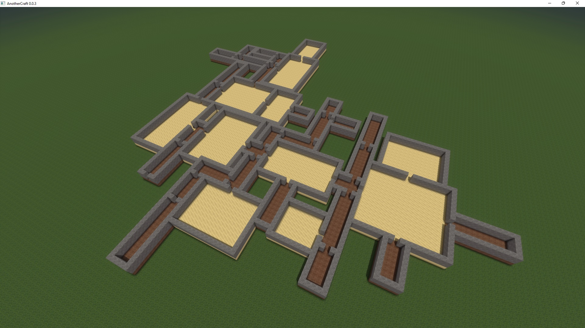

# Dungeons

Let's now try generating some dungeons using the structure generator system (see previous tutorial for the basics). Let's start with generating a simple corridor with ground and walls. We'll also generate only one instance of the dungon for now, starting at position `0, 0`. Let's also put the dungeon related code into a separate namespace called `dungeon`:

```WOGLAC
namespace dungeon {
	component corridor {
		Float length = 12;
		Float radius = 2;
		Float height = 2;

		node (0, 0, 0) entry;

		block (-radius, 0, 0) (radius, length, 0) = block.core.dirt; // Ground
		block (-radius, 0, 1) (radius, length, height) = block.core.stone; // Walls (with infill)
		block (-radius + 1, 1, 1) (radius - 1, length - 1, height) = block.air; // Empty inside
	}

	rule Entrance {
		rule -> corridor::entry;
	}
}

Float3 pos = worldPos();
Float terrainZ = 16;

export Block resultBlock =
	spawn2D(dungeon.Entrance, ~1, #53214, terrainZ, pos::xy() == float2(0)) ?:
	pos::z() < terrainZ ? block.core.grass :
	block.air
	;
```



Now let's start chaining the components. We create a new rule called `MoreDungeon` that will, well, expand to more dungeon. We don't want the dungeon to be infinite (we even't cannot make it infinite using the structure spawning), so apart from spawning another corridor, we'll allow the rule to also spawn nothing using `rule -> void;`. We also define a new exit node for the `corridor` component that will expand into the `MoreDungeon` rule.

```WOGLAC
namespace dungeon {
	component corridor {
		Float length = 12;
		Float radius = 2;
		Float height = 2;

		node (0, 0, 0) entry;
		node (0, length, 0) exit -> MoreDungeon;

		block (-radius, 0, 0) (radius, length, 0) = block.core.dirt; // Ground
		block (-radius, 0, 1) (radius, length, height) = block.core.stone; // Walls (with infill)
		block (-radius + 1, 1, 1) (radius - 1, length - 1, height) = block.air; // Empty inside
	}

	rule Entrance {
		rule -> corridor::entry;
	}

	rule MoreDungeon {
		rule -> corridor::entry;
		rule -> void {
			pragma priority = 1;
			pragma probabilityRatio = 40;
		}
	}
}

Float3 pos = worldPos();
Float terrainZ = 16;

export Block resultBlock =
	spawn2D(dungeon.Entrance, ~4, #53214, terrainZ, pos::xy() == float2(0)) ?:
	pos::z() < terrainZ ? block.core.grass :
	block.air
	;
```



Now, I've added some extra code to the `rule -> void` expansion:

* By default, all expansions have priority `1`, except for the `rule -> void`, which has `999`. Rules with higher priority are used only after all rules with lower priority fail. If we wouldn't put the `rule -> void` to priority `1`, the rule would always expand into `MoreDungeon`.
* By default, all expansions have `probabilityRatio = 100`. So we would have 50% chance that the rule would expand into nothing. Using this pragma, we can play around with the ratios.

Good. Let's expand the system more. First, let's make doorways between the corridors by adding another block area:

```WOGLAC
block (0, 0, 1) (0, 0, 2) = block.air; // Doorway
```



This works because the nodes are set up in such way that the walls are shared between the two corridors. When spawning the structure, components generated later overwrite previous data, so the newly spawned corridor overwrites the wall from the previous corridor with air (no overwrite would happen if we used `block.undefined` instead, but that would not overwrite even the wall block area in the same component).

Now, let's try also adding some corridors to the sides. We'll simmply add two more exit nodes from the `corridor` component:

```WOGLAC
node (0, 0, 0) entry;
node (0, length, 0) exit -> MoreDungeon;
node (-radius, length - radius, 0) exit -> MoreDungeon;
node (radius, length - radius, 0) exit -> MoreDungeon;
```



## Node orientation

That is... almost working, but we would like to have the corridors rotated. Well, the system automatically takes care of it if we specify the direction for each node!

```WOGLAC
node (0, 1, 0) (y-) entry;
node (0, length, 0) (y+) exit -> MoreDungeon;
node (-radius , length - radius, 0) (x-) exit -> MoreDungeon;
node (radius, length - radius, 0) (x+) exit -> MoreDungeon;
```



We have also moved the `entry` node one block inside, because before we specified the orientations, the nodes were placed over each other so they overlap. Now that they have the orientation specified, the components are connected in such a way that the nodes are facing each other.

## Areas

As you can see, the generated dungeon has a problem: we have components that are overlapping where we don't want them to, causing a mischief. We can resolve that by wrapping the component in an area. The worldgen system then makes sure that it does not generate overlapping areas. Areas can also optionally have a name, allowing multiple independent overlap checking channels.

We also define a separate `entrance` component, making sure there's some space in front of the dungeon entrance.

```WOGLAC
namespace dungeon {
	component corridor {
		Float length = 12;
		Float radius = 2;
		Float height = 2;

		node (0, 1, 0) (y-) entry;
		node (0, length, 0) (y+) -> MoreDungeon;
		node (-radius , length - radius, 0) (x-) -> MoreDungeon;
		node (radius, length - radius, 0) (x+) -> MoreDungeon;

		block (-radius, 0, 0) (radius, length, 0) = block.core.dirt; // Ground
		block (-radius, 0, 1) (radius, length, height) = block.core.stone; // Walls (with infill)
		block (-radius + 1, 1, 1) (radius - 1, length - 1, height) = block.air; // Empty inside
		block (0, 0, 1) (0, 0, 2) = block.air; // Doorway

		area (-radius, 1, 0) (radius, length, height);
	}

	component entrance {
		area (-5, -5, 0) (5, -1, 5);

		node (0, 0, 0) entry;
		node (0, 0, 0) -> EntranceCorridor;
	}

	rule Entrance {
		rule -> entrance::entry;
	}

	rule EntranceCorridor {
		rule -> corridor::entry;
	}

	rule MoreDungeon {
		rule -> corridor::entry;
		rule -> void {
			pragma priority = 1;
			pragma probabilityRatio = 180;
		}
	}
}

Float3 pos = worldPos();
Float terrainZ = 16;

export Block resultBlock =
	spawn2D(dungeon.Entrance, ~8, #53214, terrainZ, pos::xy() == float2(1, 0)) ?:
	pos::z() < terrainZ ? block.core.grass :
	block.air
	;
```



## Parameters

That's better. Now, playing around with the probability ratio is somewhat a tricky to control the dungeon size. AC Worldgen has a better solution for that - we can use structure parameters. In the entrance, we define maximum depth of expansion the system can make and add a condition that prevents the dungeon for expanding further.

We achieve this by adding the following code:

* To the `Entrance` rule, we add `param Float remainingDepth ?= 8;`. This will define the `remainingDepth` parameter and set it to 8. (The `?=` means default value, the provided value will be only used if the parameter doesn't exist yet. Since we're in the first rule in the dungeon, the parameter definitely doesn't exist.) The parameter then automatically propagates to further component and rule expansions.
* In the `MoreDungeon` rule, we add the following code:
    ```
    param Float remainingDepth;
    param remainingDepth = remainingDepth - 1;
    ```
  This code declares the `remainingDepth` parameter so we can work wiht it. The second line then decreases `remainingDepth` for all child expansions.
* And finally, in the `MoreDungeon` rule expansion to `corridor`, we add the following code:
  ```
  rule -> corridor::entry {
    param Float remainingDepth;
    condition remainingDepth > 0;
  }
  ```
  This again declares `remainingDepth` so we can use it on the first line. The second line then specifies the condition that must be met for the rule to be applicable.

The final code then looks like this:
```WOGLAC
namespace dungeon {
	component corridor {
		Float length = 12;
		Float radius = 2;
		Float height = 2;

		node (0, 1, 0) (y-) entry;
		node (0, length, 0) (y+) -> MoreDungeon;
		node (-radius , length - radius, 0) (x-) -> MoreDungeon;
		node (radius, length - radius, 0) (x+) -> MoreDungeon;

		block (-radius, 0, 0) (radius, length, 0) = block.core.dirt; // Ground
		block (-radius, 0, 1) (radius, length, height) = block.core.stone; // Walls (with infill)
		block (-radius + 1, 1, 1) (radius - 1, length - 1, height) = block.air; // Empty inside
		block (0, 0, 1) (0, 0, 2) = block.air; // Doorway

		area (-radius, 1, 0) (radius, length, height);
	}

	component entrance {
		area (-5, -5, 0) (5, -1, 5);

		node (0, 0, 0) entry;
		node (0, 0, 0) -> EntranceCorridor;
	}

	rule Entrance {
		param Float remainingDepth ?= 8;
	
		rule -> entrance::entry;
	}

	rule EntranceCorridor {
		rule -> corridor::entry;
	}

	rule MoreDungeon {
		param Float remainingDepth;
		param remainingDepth = remainingDepth - 1;

		rule -> corridor::entry {
			param Float remainingDepth;
			condition remainingDepth > 0;
		}
		rule -> void {
			pragma priority = 1;
			pragma probabilityRatio = 50;
		}
	}
}

Float3 pos = worldPos();
Float terrainZ = 16;

export Block resultBlock =
	spawn2D(dungeon.Entrance, ~8, #53214, terrainZ, pos::xy() == float2(1, 0)) ?:
	pos::z() < terrainZ ? block.core.grass :
	block.air
	;
```


## Final tweaks
Let's do some final tweaks on the system:
* Randomize the corridor length a bit. This is a simple line replace:
  ```WOGLAC
  Float length = 6 + randC(localSeed()) * 8;
  ```
* Contract the protection area to allow overlapping walls (but not intersecting corridors).
* Add rooms. Rooms are similar to corridors, but let's give them a different ground block and make them larger.

And this is the result:
```WOGLAC
namespace dungeon {
	component corridor {
		Float length = 6 + round(randC(localSeed()) * 8);
		Float radius = 2;
		Float height = 2;

		node (0, 1, 0) (y-) entry;
		node (0, length, 0) (y+) -> MoreDungeon;
		node (-radius , length - radius, 0) (x-) -> MoreDungeon;
		node (radius, length - radius, 0) (x+) -> MoreDungeon;

		block (-radius, 0, 0) (radius, length, 0) = block.core.dirt; // Ground
		block (-radius, 0, 1) (radius, length, height) = block.core.stone; // Walls (with infill)
		block (-radius + 1, 1, 1) (radius - 1, length - 1, height) = block.air; // Empty inside
		block (0, 0, 1) (0, 0, 2) = block.air; // Doorway

		area (-radius + 1, 1, 0) (radius - 1, length, height);
	}

	component room {
		Float length = 6 + round(randC(localSeed() + 1234) * 12);
		Float radius = 3 + round(randC(localSeed() + 1554) * 8);
		Float height = 2;

		node (0, 1, 0) (y-) entry;
		node (0, length, 0) (y+) -> MoreDungeon;
		node (-radius , length / 2, 0) (x-) -> MoreDungeon;
		node (radius, length / 2, 0) (x+) -> MoreDungeon;

		block (-radius, 0, 0) (radius, length, 0) = block.core.sand; // Ground
		block (-radius, 0, 1) (radius, length, height) = block.core.stone; // Walls (with infill)
		block (-radius + 1, 1, 1) (radius - 1, length - 1, height) = block.air; // Empty inside
		block (0, 0, 1) (0, 0, 2) = block.air; // Doorway

		area (-radius + 1, 1, 0) (radius - 1, length, height);
	}

	component entrance {
		area (-8, -8, 0) (8, -1, 5);

		node (0, 0, 0) entry;
		node (0, 0, 0) -> EntranceCorridor;
	}

	rule Entrance {
		param Float remainingDepth ?= 8;
	
		rule -> entrance::entry;
	}

	rule EntranceCorridor {
		rule -> corridor::entry;
	}

	rule MoreDungeon {
		param Float remainingDepth;
		param remainingDepth = remainingDepth - 1;

		rule -> corridor::entry {
			param Float remainingDepth;
			condition remainingDepth > 0;
		}
		rule -> room::entry {
			param Float remainingDepth;
			condition remainingDepth > 0;
			pragma probabilityRatio = 50;
		}
		rule -> void {
			pragma priority = 1;
			pragma probabilityRatio = 50;
		}
	}
}

Float3 pos = worldPos();
Float terrainZ = 16;

export Block resultBlock =
	spawn2D(dungeon.Entrance, ~8, #53214, terrainZ, pos::xy() == float2(2, 0)) ?:
	pos::z() < terrainZ ? block.core.grass :
	block.air
	;
```
