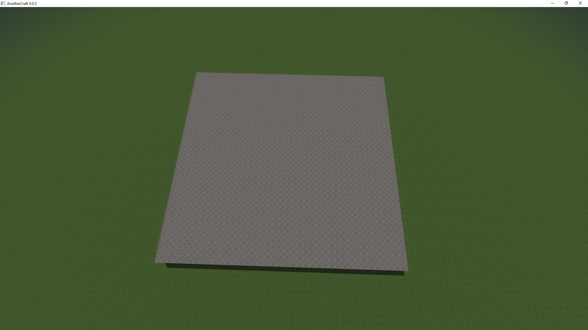
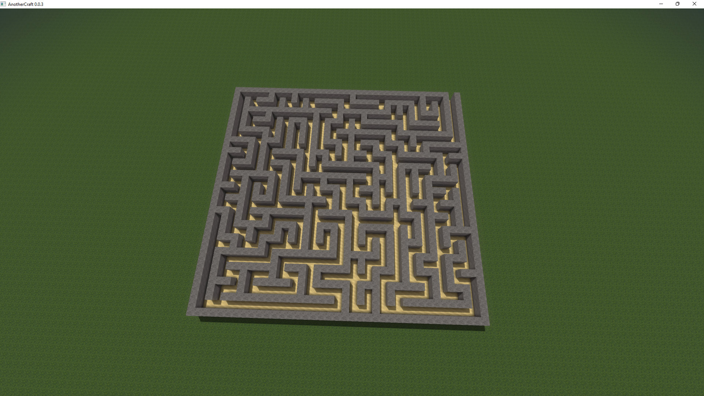
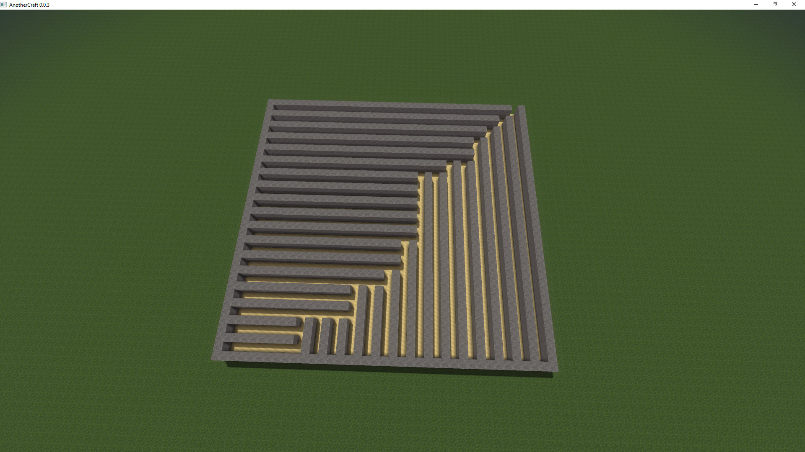
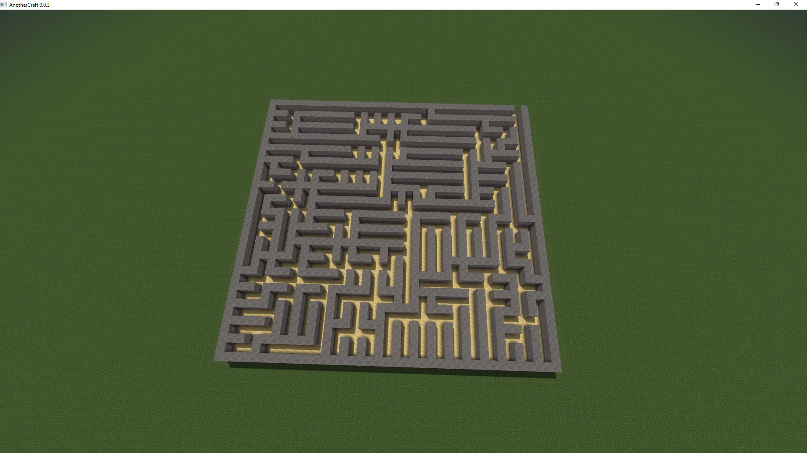
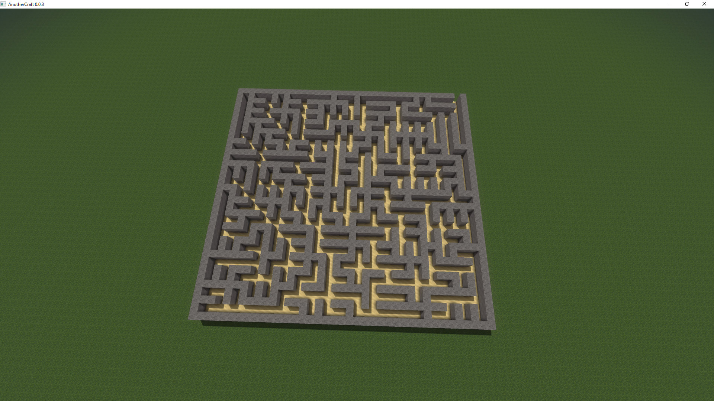
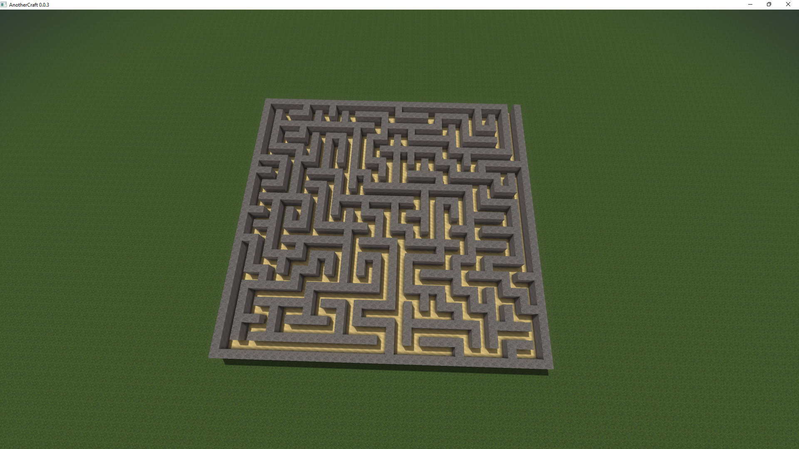
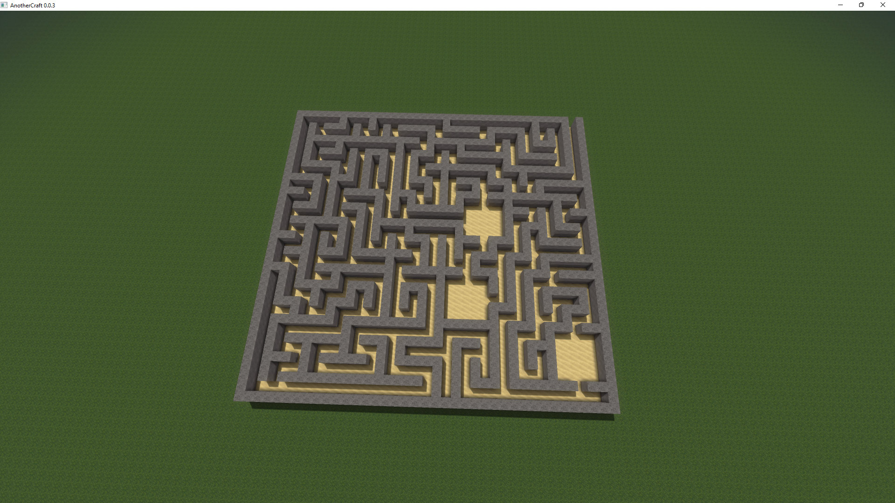
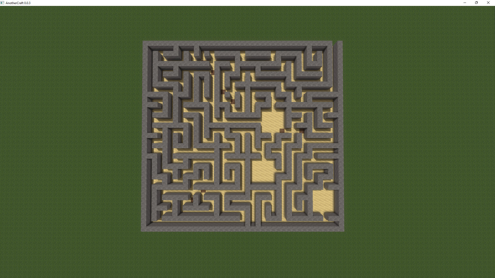
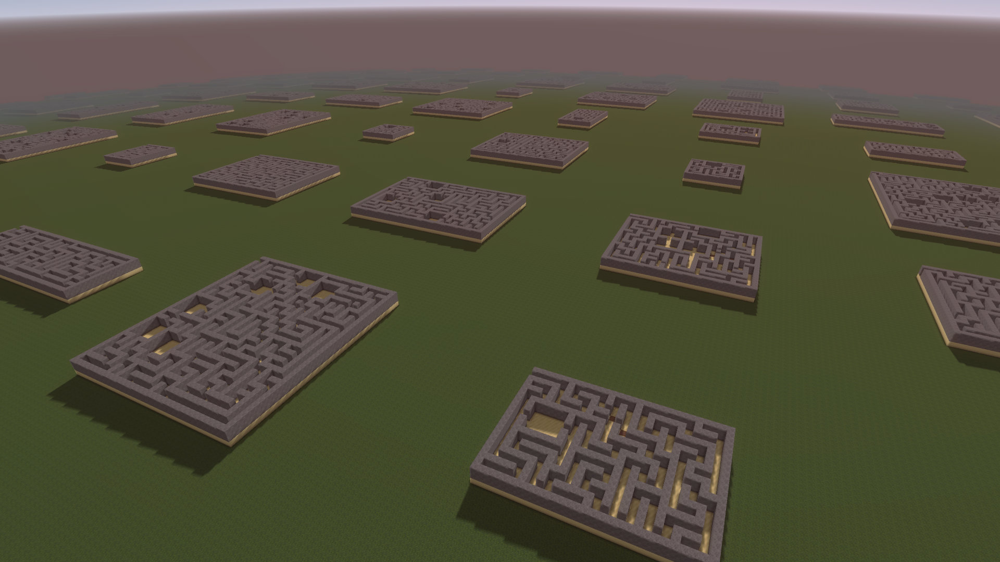

# Mazes
Let's generate some mazes! We'll do this using the structure generation system, and we'll use subtractive method: first we make a chunk of stone and then we dig the maze inside it.

Let's start with generating a chunk of stone:
```WOGLAC
namespace maze {
	rule Maze {
		rule -> maze::center;
	}

	component maze {
		Float width = 14 + floor(randL(#7461) * 16) * 2;
		Float height = 14 + floor(randL(#3642) * 16) * 2;

		block (0, 0, 0) (width, height, 0) = block.core.sand; // Floor
		block (0, 0, 1) (width, height, 2) = block.core.stone; // Fill the whole maze

		node (width / 2, height / 2, 0) center;
	}
}

Float3 pos = worldPos();
Float terrainZ = 16;

export Block resultBlock =
	spawn2D(maze.Maze, ~8, #12341, terrainZ, pos::xy() == float2(0, 0)) ?:
	pos::z() < terrainZ ? block.core.grass :
	block.air
	;
```


That's about right. Now let's add corridors:
```WOGLAC
namespace maze {
	rule Maze {
		rule -> maze::center;
	}

	rule Inside {
		pragma depthFirstProbability = 0.98;

		rule -> corridor::origin;
		rule -> void;
	}

	component maze {
		Float width = 14 + floor(randL(#7461) * 16) * 2;
		Float height = 14 + floor(randL(#3642) * 16) * 2;

		block (0, 0, 0) (width, height, 0) = block.core.sand; // Floor
		block (0, 0, 1) (width, height, 2) = block.core.stone; // Fill the whole maze

		node (width / 2, height / 2, 0) center;

		node (1, 0, 1) -> Inside;

		area (1, 1, 1) (width - 1, height - 1, 2) inside;
	}

	component corridor {
		block (0, 0, 0) (0, 1, 1) = block.air;

		node (0, 0, 0) (y-) origin;

		node (0, 1, 0) (y+) -> Inside;
		node (0, 1, 0) (x-) -> Inside;
		node (0, 1, 0) (x+) -> Inside;

		area (0, 0, 1) (0, 1, 1) (!?) inside;
		area (0, 0, 1) (0, 1, 1);
	}
}

Float3 pos = worldPos();
Float terrainZ = 16;

export Block resultBlock =
	spawn2D(maze.Maze, ~8, #12341, terrainZ, pos::xy() == float2(0, 0)) ?:
	pos::z() < terrainZ ? block.core.grass :
	block.air
	;
```


Now that was quite a big jump, so let's see what we've done here:
* We've created the `corridor` component, which basically generates a 2×1 noodle of `block.air` (that overwrites the stone block that was generated by the `maze` component).
* The `corridor` has entrance on the `y-` side on one end and then expands into more corridors on the `y+`, `x+` and `x-` sides through the `Inside` rule on the other end.
* The `Inside` rule simply expands into a corridor if it can. If it cannot, it will still succeed because of the `rule -> void` construct.
* We want to keep the corridors inside the maze area. For that, we've defined the `inside` area in the `maze` component. Corridors are then required to overlap the area by the `area (0, 1, 1) (0, 1, 1) (!?) inside;` statement.
  * The `!` symbol says that the area has to overlap a previously defined area of the same name (so the `inside` area we've defined in the `maze` component), in contrast to the default behaviour that would require the area **not** to overlap any of the other areas of the same name.
  * The `?` symbol then states to only use the area for checking and do not actually spawn it, because we don't need it.
* We also don't want the corridors to intersect, so we defined `area (0, 1, 1) (0, 1, 1);`.
* The last part of the code is defining `pragma depthFirstProbability = 0.98;` for the `Inside` rule. This says to expand the rule depth-first in `98 %` of the cases, meaining the generator will first try to follow one corridor path as long as possible and only after then will move to generating side paths. Higher value of this pragma will result in more linear maze without side branches, lower value will result in more branched maze. Low values will also make the maze contain uniform patterns, because as the nodes expand at the same time, they prevent each other from turning, resulting in a lot of parallel paths. 

Let's see how the maze would look like with various values of `depthFirstProbability`:
### `pragma depthFirstProbability = 0;`


### `pragma depthFirstProbability = 0.3;`


### `pragma depthFirstProbability = 0.6;`


### `pragma depthFirstProbability = 1;`


## Polishing
So, we've managed to generate a working maze in WOGLAC in under 50 lines of code. Every position in the maze is guaranteed to be reachable thanks to the way the maze is generated. We can easily add an exit if we want to simply by making another hole on the edge.

Let's try adding some rooms. This should not be hard, we simply define another component and add it to the `Inside` rule:
```WOGLAC
component room {
    Float size = 4;// + floor(randL(#252) * 2) * 4;
    Float center = size/2;

    block (0, 0, 0) (size, size, 1) = block.air;

    // Entrance
    block (center, -1, 0) (center, -1, 1) = block.air;
    node (center, -1, 0) (y-) origin;

    // Exits
    node (center, size, 0) (y+) -> Inside;
    node (size, center, 0) (x+) -> Inside;
    node (0, center, 0) (x-) -> Inside;

    area (0, 0, 0) (size, size, 1);

    area (0, 0, 0) (0, 0, 1) (!?) inside;
    area (size, size, 0) (size, size, 1) (!?) inside;
}

rule Inside {
    pragma depthFirstProbability = 1;

    rule -> corridor::origin;
    rule -> room::origin :10;
    rule -> void;
}
```


You can notice the line `rule -> room::origin :10;` which is using a shorthand syntax for the `probabilityRatio` pragma.

The maze is generated as tree-like structure, meaning it contains no loops. This would make it possible to traverse the labyrinth by simply following the wall. So let's add some loops. We can achieve this by creating a new joiner corridor component that does not check for area overlap and adding it to the `Inside` rule:
```WOGLAC
rule Inside {
    pragma depthFirstProbability = 1;

    rule -> corridor::origin;
    rule -> room::origin :10;
    rule -> joinerCorridor::origin !2 :1;
    rule -> void !2;
}
	
component joinerCorridor {
    block (0, 0, 0) (0, 1, 1) = block.air;
    block (0, 1, -1) = block.core.dirt;

    node (0, 0, 0) (y-) origin;

    area (0, 0, 1) (0, 1, 1) (!?) inside;
}
```


To make the loops visible, the `block (0, 1, -1) = block.core.dirt;` line puts a dirt block on the position of the joiner corridor.

The `joinerCorridor` component is added with priority `2` (using the `!xxx` shorthand) to the `Inside` rule, the same priority level as  `rule -> void`. This makes it attempt to create the joiner corridor only when we've hit a dead end, and even that we do it with a low `1:100` probability (the `rule -> void` has the default `100` probability ratio).

That's it! Here's the complete final code:
```WOGLAC
namespace maze {
	rule Maze {
		rule -> maze::center;
	}

	rule Inside {
		pragma depthFirstProbability = 1;

		rule -> corridor::origin;
		rule -> room::origin :10;
		rule -> joinerCorridor::origin !2 :1;
		rule -> void !2;
	}

	component maze {
		Float width = 14 + floor(randL(#7461) * 16) * 2;
		Float height = 14 + floor(randL(#3642) * 16) * 2;

		block (0, 0, 0) (width, height, 0) = block.core.sand; // Floor
		block (0, 0, 1) (width, height, 2) = block.core.stone; // Fill the whole maze

		node (width / 2, height / 2, 0) center;

		node (1, 0, 1) -> Inside;

		area (1, 1, 1) (width - 1, height - 1, 2) inside;
	}

	component corridor {
		block (0, 0, 0) (0, 1, 1) = block.air;

		node (0, 0, 0) (y-) origin;

		node (0, 1, 0) (y+) -> Inside;
		node (0, 1, 0) (x-) -> Inside;
		node (0, 1, 0) (x+) -> Inside;

		area (0, 0, 1) (0, 1, 1) (!?) inside;
		area (0, 0, 1) (0, 1, 1);
	}

	component joinerCorridor {
		block (0, 0, 0) (0, 1, 1) = block.air;
		block (0, 1, -1) = block.core.dirt;

		node (0, 0, 0) (y-) origin;

		area (0, 0, 1) (0, 1, 1) (!?) inside;
	}

	component room {
		Float size = 4;// + floor(randL(#252) * 2) * 4;
		Float center = size/2;

		block (0, 0, 0) (size, size, 1) = block.air;

		// Entrance
		block (center, -1, 0) (center, -1, 1) = block.air;
		node (center, -1, 0) (y-) origin;

		// Exits
		node (center, size, 0) (y+) -> Inside;
		node (size, center, 0) (x+) -> Inside;
		node (0, center, 0) (x-) -> Inside;

		area (0, 0, 0) (size, size, 1);

		area (0, 0, 0) (0, 0, 1) (!?) inside;
		area (size, size, 0) (size, size, 1) (!?) inside;
	}
}

Float3 pos = worldPos();
Float terrainZ = 16;

export Block resultBlock =
	spawn2D(maze.Maze, ~8, #1897, terrainZ, pos::xy()::mod(64) == float2(0, 0)) ?:
	pos::z() < terrainZ ? block.core.grass :
	block.air
	;
```
