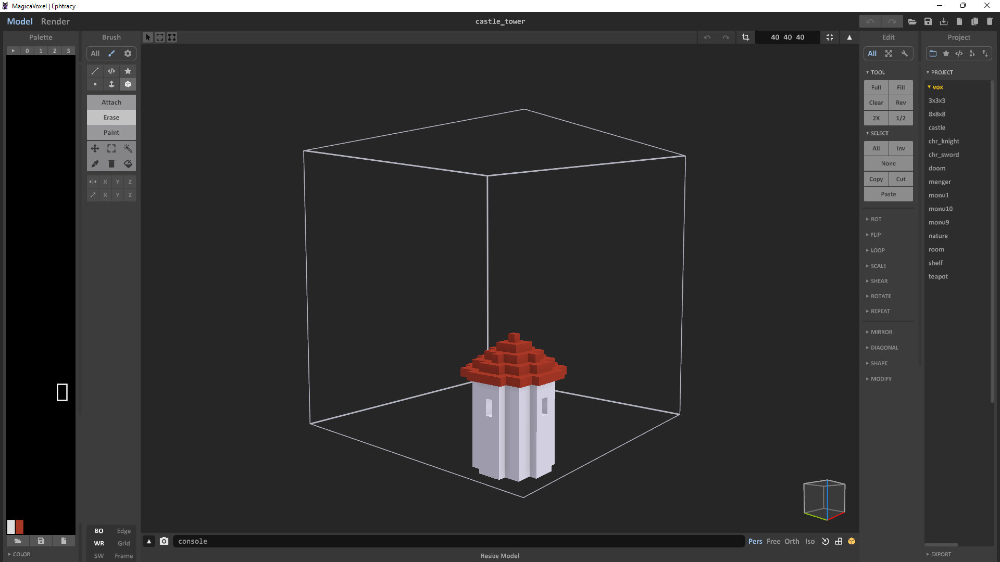
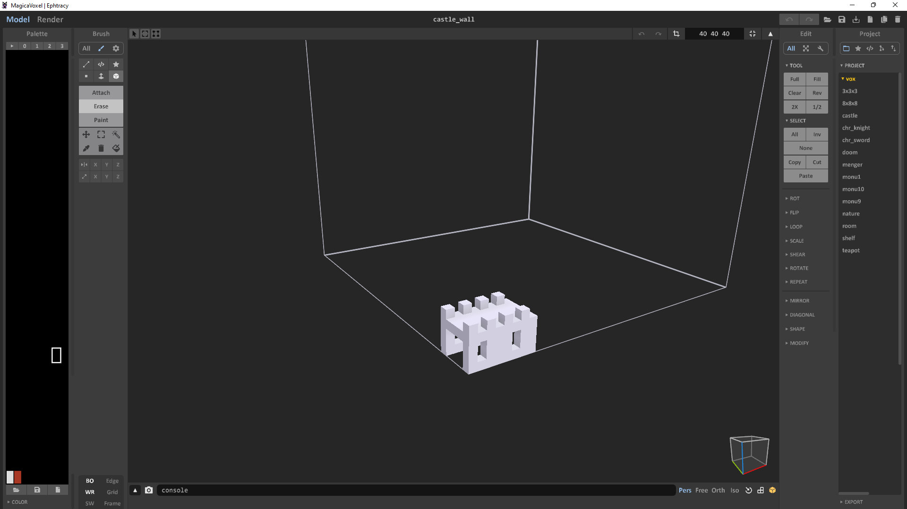
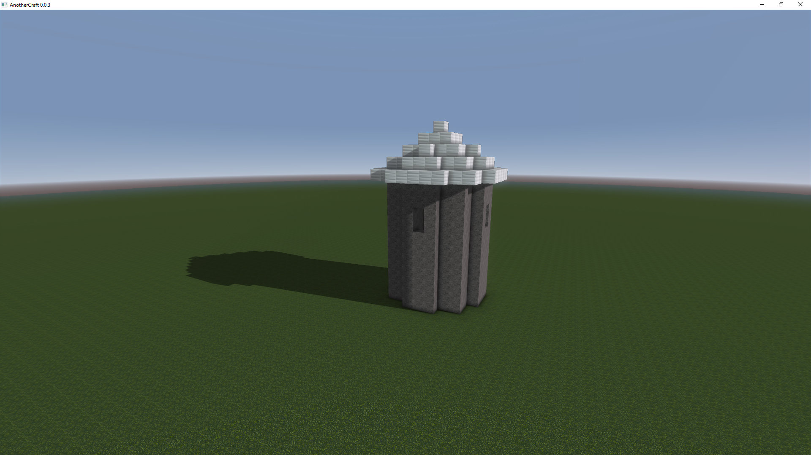
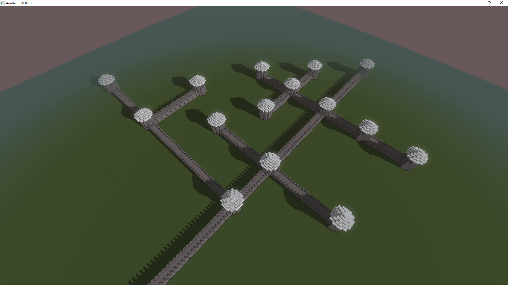
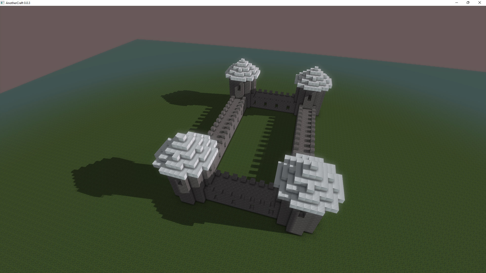

# Castle walls
Aside from defining structure components programatically, it is also possible to import data from `.vox` files. Let's create two basic designs in Magica Voxel:

* [castle_tower.vox](vox/castle_tower.vox)
* [castle_wall.vox](vox/castle_wall.vox)




Let's start by spawning a single tower. We define a new component and import the `.vox` file into it using the `component include` syntax:
```WOGLAC
component tower {
    component include "worldgen/castle_tower.vox" {
        1 -> block block.core.stone;
        2 -> block block.core.iron;
    }
}
```

The worldgen system will then go through the lookup directories passed through the `--lookupDirectory <d>` switch and try to find the specified file. Each voxel in the `.vox` file is represented as a number in range `0-255`. We need to map those numbers to our actual block IDs using the `id -> block block.XXX;` syntax. It is also possible to map certain `.vox` voxel IDs to nodes, you can find more about that in the [WOGLAC reference](../woglac_reference.md#component-includes).

A little more code and we have spawned the tower in the world:
```WOGLAC
namespace castle {
	rule Start {
		rule -> tower::center;
	}

	component tower {
		node (0, 0, 0) center;

		component include "worldgen/castle_tower.vox" {
			1 -> block block.core.stone;
			2 -> block block.core.iron;
		}
	}
}

Float3 pos = worldPos();
Float terrainZ = 16;

export Block resultBlock =
	spawn2D(castle.Start, ~16, #147, terrainZ, pos::xy() == float2(0, 0)) ?:
	pos::z() < terrainZ ? block.core.grass :
	block.air
	;
```


Let's do the same for the walls and bodge together some interesting generator:
```WOGLAC
namespace castle {
	rule Start {
		param depth = 0;

		rule -> tower::center;
	}

	rule Part {
		param Float distanceFromTower;
		param distanceFromTower = distanceFromTower + 1;

		param Float depth;
		param depth = depth + 1;
		condition depth < 20;

		rule -> tower::side :40;
		rule -> wall::origin;
	}

	rule MaybePart {
		rule -> Part :200;
		rule -> void !1;
	}

	component tower {
		param Float distanceFromTower ?= 999;
		condition distanceFromTower > 3;
		param distanceFromTower = 0;

		node (0, 0, 0) center;

		component include "worldgen/castle_tower.vox" {
			1 -> block block.core.stone;
			2 -> block block.core.iron;
		}

		node (9, 6, 0) (x+) side -> MaybePart;
		node (3, 6, 0) (x-) side -> MaybePart;
		node (6, 9, 0) (y+) side -> MaybePart;
		node (6, 3, 0) (y-) side -> MaybePart;

		area (3, 3, 0) (9, 9, 0);
	}
	
	component wall {
		node (0, 2, 0) (x-) origin;
		node (7, 2, 0) (x+) -> Part;

		area (0, 0, 0) (7, 4, 0);

		component include "worldgen/castle_wall.vox" {
			1 -> block block.core.stone;
		}
	}
}

Float3 pos = worldPos();
Float terrainZ = 16;

export Block resultBlock =
	spawn2D(castle.Start, ~16, #147, terrainZ, pos::xy() == float2(0, 0)) ?:
	pos::z() < terrainZ ? block.core.grass :
	block.air
	;
```


 Several notes about the code:
 * To prevent infinite spawning, distance from the start is limited using the `depth` parameter.
 * To prevent the towers from spawning too close, we introduced the `distanceFromTower` parameter.
 * The code is written in such a way that the walls always end with a tower. The `Part` rule the `wall` component is using always expands either to a wall or to a tower. The only rule that can expand into nothing is `MaybePart` that is only used in the towers. This means that for each side of the tower, either another string of walls ending with a tower will spawn, or nothing will be spawned.
 * You can notice that the `tower` component has four nodes that are all named `side` and that all expand to `MaybePart`. These are used as both entry and exit nodes, meaning that the `Part` rule expansion `rule -> tower::side :40` can choose (randomly) either of the `side` nodes to spawn the component from. The remaining nodes will then be used as exit nodes and will expand to `MaybePart`.

## Creating loops
Say we want to create a single closed loop with the walls, creating city/castle walls. The structure generation system is tree-based in principle and connecting branches is generally a bit complicated, because they cannot communicate with each other. However there are two ways in how such connection/loop could be made:
1. We could pass the loop end position as a parameter and allow `rule -> void` only on the given position.
2. We could utilize the force-overlap area functionality.
3. The system merges two components that are attempted to be spawned on the exact same position, with the exact same orientation and exact same component type.

Let's try creating a single closed loop of wall using every of the mentioned methods.

### Creating loops by passing the end position as param
```WOGLAC
namespace castle {
	rule Start {
		param depth = 0;
		param towerCount = 0;
		rule -> tower::center;
	}

	rule Part {
		param Float distanceFromTower;
		param distanceFromTower = distanceFromTower + 1;

		param Float depth;
		param depth = depth + 1;
		condition depth < 25;

		rule -> tower::entry :50;
		rule -> wall::entry;
		rule -> void {
			param Float3 endPos;
			condition endPos::distanceTo() < 2;
		}
	}

	component tower {
		param Float distanceFromTower ?= 999;
		condition distanceFromTower > 1;
		param distanceFromTower = 0;

		param Float towerCount;
		param towerCount = towerCount + 1;
		condition towerCount < 4;

		param Float3 endPos ?= entry::worldPos();

		node (0, 0, 0) center;

		component include "worldgen/castle_tower.vox" {
			1 -> block block.core.stone;
			2 -> block block.core.iron;
		}

		node (9, 6, 0) (x+) -> Part;
		node (6, 3, 0) (y-) entry;

		area (3, 3, 0) (9, 9, 0);
	}
	
	component wall {
		node (0, 2, 0) (x-) entry;
		node (7, 2, 0) (x+) -> Part;

		area (0, 0, 0) (7, 4, 0);

		component include "worldgen/castle_wall.vox" {
			1 -> block block.core.stone;
		}
	}
}

Float3 pos = worldPos();
Float terrainZ = 16;

export Block resultBlock =
	spawn2D(castle.Start, ~16, #151, terrainZ, pos::xy() == float2(0, 0)) ?:
	pos::z() < terrainZ ? block.core.grass :
	block.air
	;
```


The structure generator has a limited number of attempts it will make when trying to expand structures until it fails, so we need to limit the possibilities as much as possible to not make the generator waste time trying combinations that would not work. In the code above, we've done the following:
* Limit maximum number of components to 25 using hte `depth` param.
* Make the `tower` component only spawn walls to the right of the `entry` node. This makes the wall generation always only turn right.
* Don't allow spawning more than `4` towers.