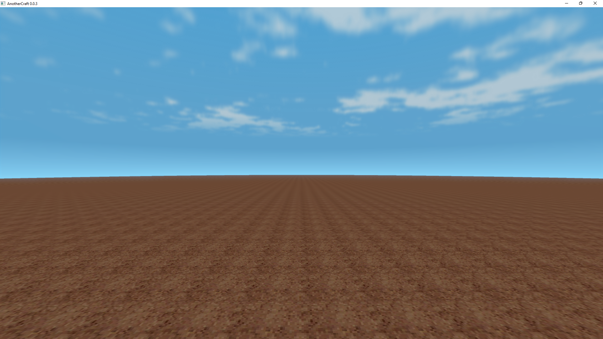
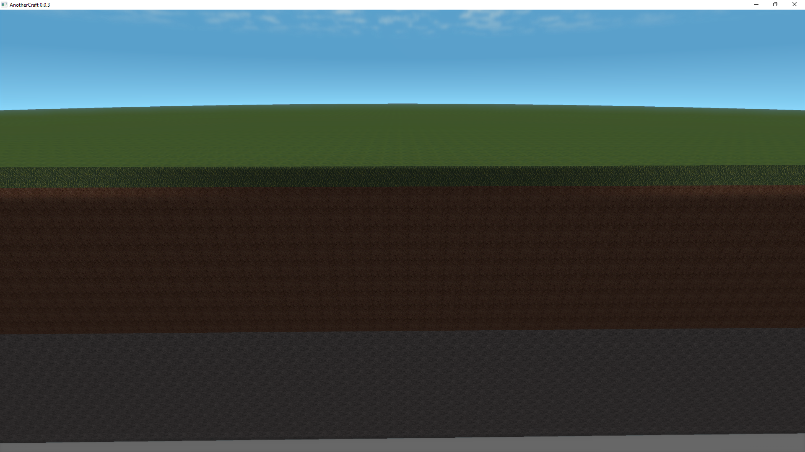
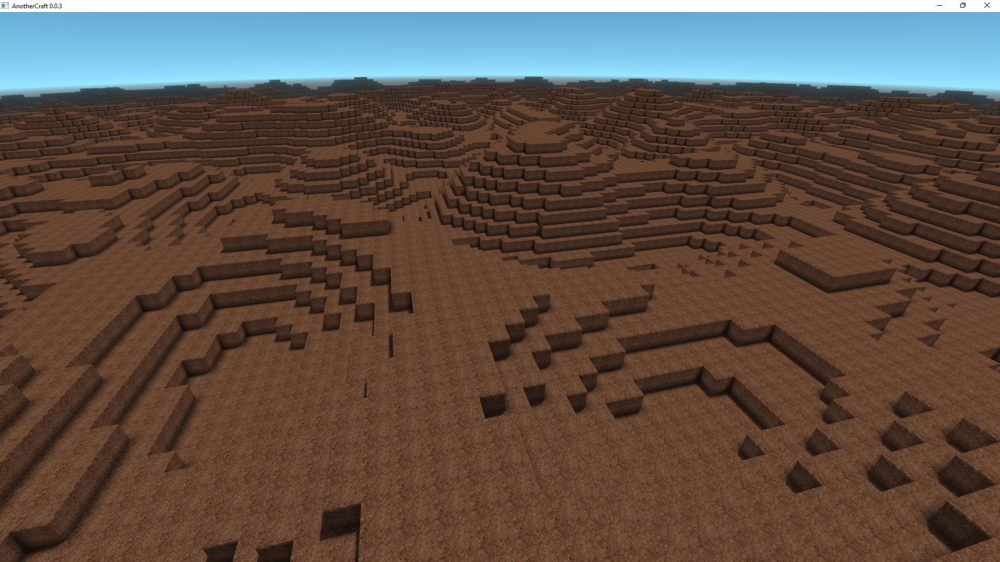
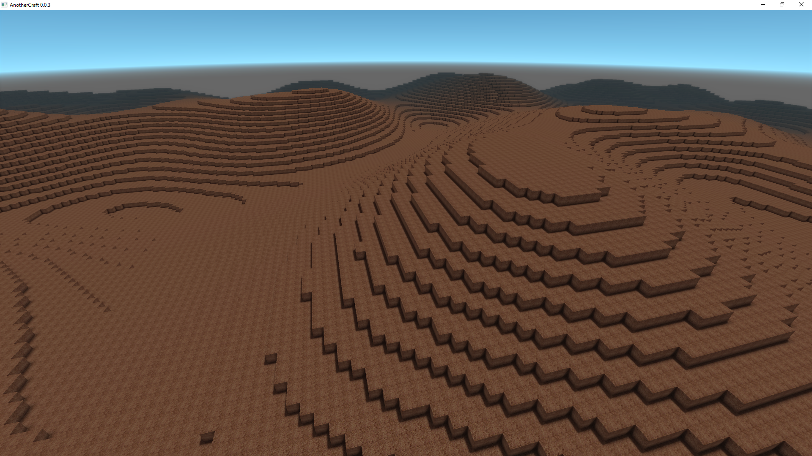
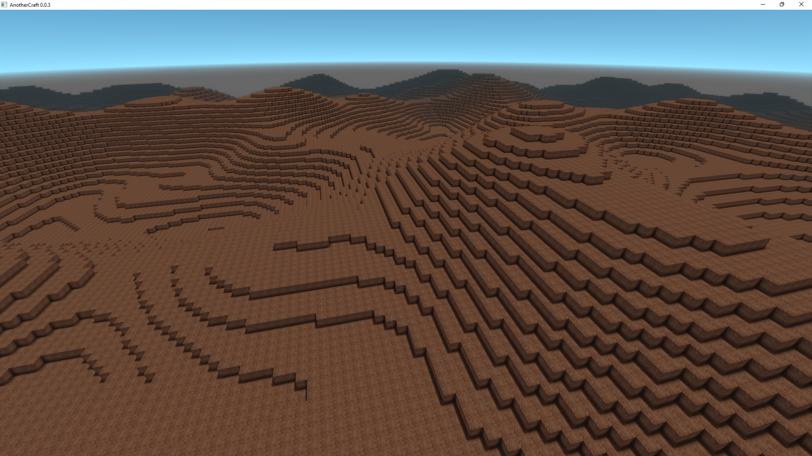
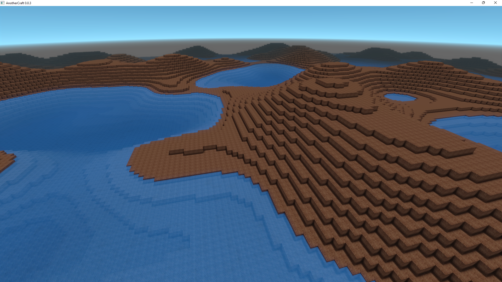

# Woglac tutorial
Let's give you some quick introduction what you can do with WOGLAC and how you can do it.

### See also
* [Language reference](docs/woglac_reference.md)
* [Function list](docs/function_list.md)

## Basic contepts
Writing in WOGLAC is similar to writing shaders, though the approach is more functional. We're basically writing a function `f(x, y, z) -> block`, that takes a position as an input and returns a block that belongs on that position. This means that technically, every block can be computed completely independently (and in parallel) and you can ask for any block at any position in the world without having to generate other blocks around.

This is more or less true even in practice, except the worldgen system works with 16×16×16 chunks and uses some heavy caching for the temporary results.

## Flatlands
Let's start with generating flatlands. We'll use the `Float3 worldPos()` function that returns the position of the block we're currently generating and the `Float z(Float3 vec)` that returns the `z` component of a vector.

```WOGLAC
export Block resultBlock = worldPos()::z() < 20 ? block.core.dirt : block.air;
```


We define an `export` variable `resultBlock` (that we'll be querying from the client application - see [Application interface](app_interface.md)) and set it to `block.core.dirt` for blocks that are below `z` `20` or to air for the blocks above. Simple.

The only weird thing is the `worldPos()::z()` syntax. In WOGLAC, `a::func(b, c)` is equivalent to `func(a, b, c)`, so we might as well have written `z(worldPos())`, but in this case, using the `::` makes the code more readable. This is similar to the [Uniform function call syntax](https://en.wikipedia.org/wiki/Uniform_Function_Call_Syntax).

## Layered flatlands
What if we want to have multiple layers? Simply use a ternary operator!

```WOGLAC
Float z = worldPos()::z();

export Block resultBlock = worldPos()::x() < 0 ? block.air : z < 10 ? block.core.stone : z < 19 ? block.core.dirt : z < 20 ? block.core.grass : block.air;
```



## Hills
For generating hills, we can start off with basic 2D [Perlin noise](https://en.wikipedia.org/wiki/Perlin_noise). For that, woglac offers the function `Float perlin2D(Float octaveSize, Float seed)` that returns `-1` to `1` for each `x, y` position. `octaveSize` denotes the scale of the noise in chunks (16 blocks). For `seed` we just bash the keyboard for some random number to make the noise unique – calling the function with the same seed always produces the same results. To make the code more readable, the `octaveSize` paremeters are prefixed with `~` and `seed` parameters are prefixed with `#`.

```WOGLAC
Float z = worldPos()::z();

Float noiseHeight = 10;
Float terrainZ = 20 + perlin2D(~1, #6648) * noiseHeight;
export Block resultBlock = z < terrainZ ? block.core.dirt : block.air;
```


Okay, now let's make the hills bigger by increasing the `octaveSize` and higher by increasing `noiseHeight`:
```WOGLAC
Float z = worldPos()::z();

Float noiseHeight = 20;
Float terrainZ = 10 + perlin2D(~4, #6648) * noiseHeight;
export Block resultBlock = z < terrainZ ? block.core.dirt : block.air;
```


Now these look too uniform. We can add more variation by adding a second, smaller Perlin noise:
```WOGLAC
Float z = worldPos()::z();

Float noiseHeight = 20;
Float terrainZ = 10 + perlin2D(~4, #6648) * noiseHeight + perlin2D(~2, #6648) * noiseHeight * 0.5;
export Block resultBlock = z < terrainZ ? block.core.dirt : block.air;
```


Now we can also add water:
```WOGLAC
Float z = worldPos()::z();

Float noiseHeight = 20;
Float waterZ = 10;
Float terrainZ = 10 + perlin2D(~4, #6648) * noiseHeight + perlin2D(~2, #6648) * noiseHeight * 0.5;
export Block resultBlock = z < terrainZ ? block.core.dirt : z < waterZ ? block.core.water : block.air;
```
